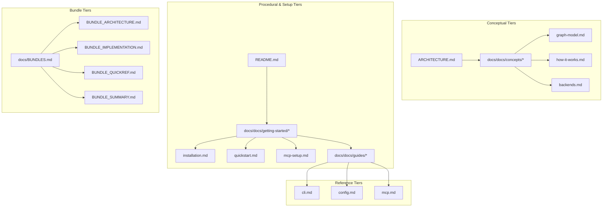

# CodeGraphContext: Master Roadmap & Engineering Audit

> **Version**: 0.4.15 → 1.0.0  
> **Period**: June 2026 — December 2026  
> **Milestones**: 100  

This document serves as the master strategic roadmap and engineering audit for the CodeGraphContext (CGC) project. It is divided into four main sections:
1. **Engineering Deep Dive & Hidden Gaps**: A low-level audit of architectural flaws and bugs.
2. **Complete Feature Inventory**: Everything CGC currently does.
3. **Roadmap Phase 1 (Months 1-3)**: Foundational refactoring, database optimization, and core engine improvements.
4. **Roadmap Phase 2 (Months 4-6)**: VS Code extension, Web LLM integrations, Ollama, and Graph RAG.

---

## Part 1: Comprehensive Missed Points & Codebase Deep Dive

This section catalogs discovered code paths, architectural design details, hidden behaviors, testing flaws, and bugs within the repository, organized by folder and file.

### 1. Root & Entrypoints (`src/codegraphcontext/`)
* **`__init__.py` & `__main__.py`**: Exposes the package API. `__main__.py` immediately redirects execution to the Typer CLI entrypoint in `cli.main:app()`.
* **`prompts.py`**: Defines standard system prompts for LLM reasoning. **Gap**: System prompts have hardcoded formatting constraints assuming Markdown, not adjusting to JSON or other interface layouts.
* **`tool_definitions.py`**: Declares JSON schema definitions for 15+ MCP tools. **Gap**: Tool definitions must match their corresponding python handler signatures manually. There is no dynamic typing or reflection-based schema generation, leading to potential drift.

### 2. Web API & SSE Transport (`src/codegraphcontext/api/`)
* **`app.py`**: Configures CORS middleware for browser connections and integrates the MCP server directly into the HTTP router.
* **`mcp_sse.py`**: SSE transport layer wrapper bridging JSON-RPC message framing to HTTP streaming responses.
* **`router.py` & `schemas.py`**: Defines FastAPI REST endpoints and Pydantic models for querying index states.

### 3. Core Database Engine & Interfaces (`src/codegraphcontext/core/`)
* **`database.py`**: Factory method `get_database_manager` resolves DB type from `CGC_RUNTIME_DB_TYPE` or `.env`. **Gap**: No schema validation upon instantiation. Connection pooling is managed entirely within sub-managers (no centralized pool).
* **`database_neo4j.py`**: Driver for remote Neo4j. **Gap**: Uses session-level executions rather than explicit transactions in some areas, risking incomplete rollbacks during concurrent writes.
* **`database_kuzu.py`**: Embedded KuzuDB wrapper. **Gap**: Contains extensive Cypher compilations (e.g., translates `ORDER BY node.property` to column aliases, converts fulltext indexes to string-matching searches, injects fallback `uid`s to resolve binder exceptions). Records fail-fast queries in memory to skip recurrent binder warnings.
* **`database_ladybug.py`**: Wrapper for LadybugDB. Shares Kuzu's Cypher dialect constraints. **Gap**: Exhibits high virtual memory footprints (>3 GB) during batch ingestion because it stores transactions in-memory before committing.
* **`database_falkordb.py` & `database_falkordb_remote.py`**: Local/Remote FalkorDB. **Gap**: If the temporary unix socket file (`falkordb.sock`) is deleted, the driver crashes without reconnection attempts.
* **`database_nornic.py`**: HTTP-based JSON payload API (not binary protocol). **Gap**: Lacks native graph transactions, suffering latency in deep-nested call-tree traversals.
* **`falkor_worker.py`**: Manages Redis/FalkorDB subprocess. **Gap**: Port collisions and stale `.pid` files can leave dead Redis server processes running.
* **`cgc_bundle.py`**: Manages `.cgc` archive import/export. **Gap**: Importer does not validate index schemas prior to restoring data. Custom bundles conflicting with pre-configured schemas cause migration failures and DB corruption.
* **`bundle_registry.py`**: Handles Hugging Face registry downloads. **Gap**: No cryptographic signature/hash checking on downloaded bundles, posing a supply-chain security risk.
* **`jobs.py`**: Manages background asynchronous jobs. **Gap**: In-memory queue means all pending/running jobs are lost on server/IDE restart. Swallows tracebacks on failed tasks.
* **`watcher.py` & `cgcignore.py`**: File-system watching and exclusion rules. **Gap**: `.cgcignore` does not support git wildcard extensions like `**` properly, parsing them as standard regex wildcards and skipping nested mono-repo folders.

### 4. CLI Tooling & Setup Wizards (`src/codegraphcontext/cli/`)
* **`main.py`**: Typer CLI (2386 lines). **Gap**: Swallows exceptions on incorrect cypher syntax in `cgc query`, outputting generic errors instead of raw DB tracebacks.
* **`config_manager.py`**: **Gap**: Reads `.env` files recursively by climbing the directory tree without bounds (security risk in shared server environments).
* **`cli_helpers.py`**: Includes `CGCDiskCache` for AST tokens. **Gap**: Disk cache lacks an automatic eviction policy, growing unbounded over time.
* **`registry_commands.py`**: **Gap**: Fuzzy Name Resolver downloads the most recent timestamped bundle if a commit hash isn't specified, which can be inaccurate. On-demand requests only output instructions rather than calling webhooks directly.
* **`setup_wizard.py` & `setup_macos.py`**: **Gap**: Lacks validation for permissions/write access when configuring global system settings (Homebrew).
* **`visualizer.py`**: **Gap**: Limited to node connections. Large queries truncate, and formatting crashes if nodes lack a `name` property.

### 5. AST Extraction & Graph Architecture (`src/codegraphcontext/tools/`)
* **`graph_builder.py`**: **Gap**: Relies on deep recursion for AST tree traversal. Extremely nested/autogenerated files trigger Python's recursion limit.
* **`code_finder.py`**: **Gap**: Uses heuristic fallbacks for `CALLS` edge resolution. If static resolution fails, it queries for any function node matching that name, causing false-positive edges.
* **`scip_indexer.py`**: **Gap**: Requires external `scip` CLI utility. Falls back silently to Tree-sitter if missing, failing on complex external cross-package imports.
* **`tree_sitter_parser.py`**: **Gap**: Thread-safety issues when compiling language parser `.so` libraries concurrently.
* **`package_resolver.py`**: **Gap**: Lacks support for lockfiles (`poetry.lock`, `package-lock.json`) to pin exact dependency versions.

### 6. AST Language Parsers (`src/codegraphcontext/tools/languages/`)
* Supports 26 parsers.
* **Gaps**: Query selectors break if tree-sitter grammars are updated. Parsers like `rust.py` and `cpp.py` don't resolve complex namespace chains statically, conflating functions with matching names.

### 7. Tool Integrations & MCP Server (`src/codegraphcontext/server.py`)
* **`server.py`**: Truncates output to fit `MAX_TOOL_RESPONSE_TOKENS` by estimating 4 characters per token. Strips `/workspace/` prefix for container compatibility. Dynamically disables tools based on `disabledTools` config.

### 8. Utilities & Graph Visualization (`src/codegraphcontext/utils/` & `viz/`)
* **`tree_sitter_manager.py`**: Compiles all libraries into a single shared object file.

### 9. Datasources (`src/codegraphcontext/tools/datasources/`)
* **`cassandra_ingester.py`, `mysql_ingester.py`**: **Gap**: Lacks SSL support when connecting to instances, throwing socket errors on secure enterprise databases.

### 10. Testing Gaps & Bugs
* **`test_issue_806_fix.py`**: Bug on Line 484 has a hardcoded path (`/home/pc1/Desktop/CodeGraphContext`), failing on other machines.
* **`test_database_kuzu_compat.py`**: Failing assumptions on inheritance fail-fast guards and `UNWIND` uid injection fallbacks (global params cause identical UIDs).

---

## Part 2: Complete Inventory of Everything CGC Has Today

### 📊 Project Statistics (as of v0.4.15)
* **Python lines**: ~25,000+
* **Website (React/TS) lines**: ~15,000+
* **VS Code Extension lines**: ~3,500+
* **Language parsers**: 26 files (24 languages + Gradle/Maven/MyBatis)
* **Database backends**: 5 (+ LadybugDB)
* **MCP tools**: 21
* **CLI commands**: 55+
* **Test files**: ~50+
* **GitHub Actions workflows**: 10
* **Documentation pages (MkDocs)**: 22+

### 🔧 Category 1: Ingestion & Parsing Engine
* **Stable Parsers**: Python, JS/TS/TSX, Go, Rust, C, C++, Java, Ruby, C#, PHP, Kotlin, Scala, Swift, Dart, Perl, Haskell, Elixir, Lua, Elisp.
* **New Parsers**: HTML, CSS, Gradle, Maven, MyBatis.
* **Core Systems**: Polyglot Tree-Sitter framework, SCIP precise indexer, Package resolvers (9 languages), Indexing pipeline, File discovery (`.cgcignore`), Import pre-scanning, Graph schema creation, Property sanitization, GraphWriter (Cypher MERGE/CREATE), Function call & Inheritance resolution, File system watcher (incremental re-index).

### 🗄️ Category 2: Graph Database Layer
* **Backends**: FalkorDB Lite (embedded Unix), FalkorDB Remote, KuzuDB (embedded cross-platform), Neo4j (server bolt), Nornic DB.
* **Core Systems**: Auto-detect DB backend cascade, Unified driver wrappers, Graph schema (17 labels, 7 edge types).

### 🔍 Category 3: Query & Analysis Engine (CodeFinder)
* **Search Types**: Function, Class, Variable, Module, Node type, Full-text.
* **Relationships**: Who calls function, what does function call (direct + transitive), Function call chains, Class hierarchy, Function overrides, Dead code detection, Cyclomatic complexity, Variable usage scope/modifiers.
* **Analysis**: Report generator, Type utilities.
* **Gap**: Advanced language query tool routing (all 16 toolkits currently raise `NotImplementedError`).

### 🖥️ Category 4: Interfaces (MCP Server, CLI, API)
* **MCP Server**: 21 tools over stdio, Context discovery, LLM system prompts.
* **CLI**: 55+ Typer commands, Config manager (YAML/Contexts), Setup wizards (Cursor, Claude, VS Code, etc.), Registry commands, `cgc doctor`.
* **API**: FastAPI REST API, Viz Server (React SPA host).

### 🌐 Category 5: Website & Visualization
* **Pages**: Landing, Explorer, PR Reviewer, Privacy, Cookbook, Docs.
* **Visualizers**: CodeGraphViewer (2D/3D Force, 3D City Treemap), Mermaid FlowchartSVG.
* **Web Tech**: In-browser Tree-sitter parsing (Web Worker/WASM), LocalUploader, Bundle Generator/Registry, Social mentions timeline, 4 visual themes.
* **Backend**: Vercel serverless APIs, Rate limiting.

### 🧩 Category 6: VS Code Extension
* **Early Features**: Extension activation (12 commands), Open Dashboard, Call Graph webview, Analyze Relationships, Run Indexing Wizard, Variable Impact Radius, Code Health Report generator.
* **Views**: Control Panel webview, Dashboard webview, Setup wizard, Explorer bundles view.

---

## Part 3: Roadmap Phase 1 (Months 1-3)

### Month 1: Architectural Refactoring, Test Isolation & Benchmarking (M1–M15)
> **Theme**: Clean the foundations. De-monolith the codebase, isolate all tests, build a real performance bench.

#### M1 — Split `cli/main.py` into Sub-Command Modules
- **Team**: 🔴 PythonDevs
- **Difficulty**: 🟡 Medium
- **Knowledge**: Typer CLI groups, Python package imports
- **Deliverable**: Separate `cli/commands/index.py`, `find.py`, `analyze.py`, `bundle.py`, `registry.py`, `config.py`, `context.py`, `mcp.py`, `neo4j.py`. Main becomes a thin router.
- **📈**: CLI startup is faster (lazy imports). Each command group is independently testable. Maintenance overhead drops significantly.
- **Fixes**: B4

#### M2 — Refactor `CodeGraphViewer.tsx` into Subcomponents
- **Team**: 🔴 WebDevs
- **Difficulty**: 🔴 Hard
- **Knowledge**: React, TypeScript, state management, force-graph libraries
- **Deliverable**: Extract `GraphCanvas`, `SidebarFileTree`, `CodeViewerPanel`, `SearchAndFilter`, `VisualSettingsPanel`, `ThemeSwitcher` from the 106 KB monolith.
- **📈**: Frontend bugs become isolatable. New visualization modes can be added without touching the core canvas. 
- **Fixes**: B5

#### M3 — Split `code_finder.py` into Domain Modules  
- **Team**: 🔴 PythonDevs
- **Difficulty**: 🟡 Medium
- **Knowledge**: Python class composition, Cypher query organization
- **Deliverable**: Extract query methods into `query/search.py`, `query/callgraph.py`, `query/inheritance.py`, `query/analysis.py`, `query/management.py`. CodeFinder becomes a facade.
- **📈**: Each query domain is independently extensible. New analysis methods don't bloat the main file.
- **Fixes**: B6

#### M4 — Database Query Interface Protocol (GraphQueryInterface)
- **Team**: 🔴 AdminArchs
- **Difficulty**: 🔴 Hard
- **Knowledge**: Abstract Base Classes, Cypher dialects (KuzuDB vs Neo4j vs FalkorDB)
- **Deliverable**: Define `GraphQueryInterface` ABC with backend-specific implementations. CodeFinder programs against the interface, not raw Cypher.
- **📈**: Eliminates Cypher dialect crashes. KuzuDB `UNWIND` and aggregation failures disappear. New backends can be added by implementing the interface.
- **Fixes**: B8

#### M5 — Clean & Isolate Test Suite
- **Team**: 🔴 Testers
- **Difficulty**: 🟡 Medium
- **Knowledge**: pytest, mocking, CI environments
- **Deliverable**: Remove dead `test_mixins.py` Ruby fixture. Deduplicate C++ tests. Mock DB in `test_cgcignore_patterns.py`. Mark all tests with `@pytest.mark.unit/integration/e2e`.
- **📈**: CI pipeline succeeds on every commit without needing a live DB or pre-installed binaries.
- **Fixes**: B15

#### M6 — Standardized MCP Error Schema
- **Team**: 🔴 PythonDevs
- **Difficulty**: 🟢 Easy
- **Knowledge**: MCP protocol, JSON-RPC error codes
- **Deliverable**: Define error codes (`CGC_INDEX_NOT_FOUND`, `CGC_DB_CONNECTION_LOST`, `CGC_QUERY_FAILED`, etc.) in `error_codes.py`. All handlers return structured errors.
- **📈**: AI assistants understand *why* a tool call failed and can suggest recovery actions.

#### M7 — Bundle Schema Versioning & `cgc bundle validate`
- **Team**: 🔴 PythonDevs
- **Difficulty**: 🟡 Medium
- **Knowledge**: ZIP archiving, JSON schema, semver
- **Deliverable**: Add `schema_version` to `.cgc` bundle `metadata.json`. Create `cgc bundle validate <path>` CLI command.
- **📈**: Prevents older CGC from loading incompatible bundles. Users get clear upgrade instructions.

#### M8 — Real-World Ingestion Benchmark Suite
- **Team**: 🔴 Testers
- **Difficulty**: 🟡 Medium
- **Knowledge**: Benchmarking methodology, performance telemetry, statistics
- **Deliverable**: Expand `scripts/benchmark_cgc.py` with a standard corpus (Flask, FastAPI, Express). Track LOC/sec, node creation rate, and DB insertion latency across all backends.
- **📈**: Quantitative regression detection on every release. Marketing-ready performance numbers.

#### M9 — Query Latency Profiling & `EXPLAIN` Integration
- **Team**: 🔴 Testers
- **Difficulty**: 🟢 Easy
- **Knowledge**: Python timing, Cypher `EXPLAIN`/`PROFILE`
- **Deliverable**: Add timing to all CodeFinder queries. Output in `--verbose` CLI mode and debug logs. Add `cgc analyze benchmark` command.
- **📈**: Developers identify slow queries instantly. Database index gaps become visible.

#### M10 — Persistent Job Manager (SQLite-backed)
- **Team**: 🔴 AdminArchs
- **Difficulty**: 🟡 Medium
- **Knowledge**: SQLite, async job states
- **Deliverable**: Replace in-memory dict in `JobManager` with SQLite table under `.codegraphcontext/jobs.db`. Jobs survive server restarts.
- **📈**: Long-running index jobs report correct states after IDE/MCP restart. No more "phantom jobs".
- **Fixes**: B3

#### M11 — Implement Python `*Toolkit` Advanced Queries
- **Team**: 🔴 PythonDevs
- **Difficulty**: 🟡 Medium
- **Knowledge**: Python AST patterns, decorators, dynamic imports
- **Deliverable**: Implement `PythonToolkit` in `query_tool_languages/` — decorator resolution, dynamic import boundaries, context manager detection.
- **📈**: AI assistants get Python-specific advanced queries.
- **Fixes**: B14 (partial)

#### M12 — Implement JS/TS `*Toolkit` Advanced Queries
- **Team**: 🔴 WebDevs
- **Difficulty**: 🟡 Medium
- **Knowledge**: JS/TS AST, React patterns, export styles
- **Deliverable**: Implement JS/TS/TSX toolkits — named/default export analysis, React hook dependency tracking, Express route detection.
- **📈**: JS/TS-specific queries work.
- **Fixes**: B14 (partial)

#### M13 — Implement Go & Rust `*Toolkit` Advanced Queries
- **Team**: 🔴 PythonDevs
- **Difficulty**: 🟡 Medium
- **Knowledge**: Go interfaces/struct composition, Rust traits/impl blocks
- **Deliverable**: Implement Go toolkit (struct composition, goroutine detection) and Rust toolkit (trait implementations, lifetime annotations).
- **📈**: AI can query Go/Rust-specific patterns accurately.
- **Fixes**: B14 (partial)

#### M14 — Implement Java & C# `*Toolkit` Advanced Queries
- **Team**: 🔴 PythonDevs
- **Difficulty**: 🟡 Medium
- **Knowledge**: JVM/CLR patterns, annotations, generics
- **Deliverable**: Implement Java toolkit (annotation queries, generic constraints) and C# toolkit (LINQ patterns, attribute queries, property accessors).
- **📈**: Enterprise-language advanced queries work.
- **Fixes**: B14 (partial)

#### M15 — Implement C/C++ `*Toolkit` Advanced Queries
- **Team**: 🔴 PythonDevs
- **Difficulty**: 🔴 Hard
- **Knowledge**: C/C++ preprocessor, macro chains, header inclusion
- **Deliverable**: Implement C/C++ toolkits — macro expansion tracing, header-source relationship mapping, preprocessor conditional analysis.
- **📈**: AI can trace C++ macro chains and header dependencies.
- **Fixes**: B13, B14 (partial)

### Month 2: Database Optimization & Core Engine Improvements (M16–M30)
> **Theme**: Make the engine faster, smarter, and more reliable. True async drivers, connection pooling, streaming.

#### M16 — Non-Blocking Async Database Drivers
- **Team**: 🔴 AdminArchs
- **Difficulty**: 🔴 Hard
- **Knowledge**: Python `asyncio`, `neo4j.AsyncDriver`, KuzuDB async API
- **Deliverable**: Refactor DB connection layer to use async calls. Eliminate `asyncio.to_thread` wrappers for database operations.
- **📈**: 2-3x throughput improvement under concurrent MCP tool calls. No more thread pool saturation.
- **Fixes**: B2

#### M17 — DB Connection Pooling
- **Team**: 🔴 AdminArchs
- **Difficulty**: 🟡 Medium
- **Knowledge**: Connection pooling patterns, Neo4j driver pools
- **Deliverable**: Implement connection pool for Neo4j and KuzuDB adapters. Configurable pool size via `CGC_DB_POOL_SIZE`.
- **📈**: Eliminates connection handshake overhead for consecutive queries.
- **Fixes**: B9

#### M18 — Query Result Streaming
- **Team**: 🔴 PythonDevs
- **Difficulty**: 🟡 Medium
- **Knowledge**: Python generators, streaming JSON, chunked responses
- **Deliverable**: Implement generator-based streaming for large Cypher result sets. Add `--stream` flag to CLI queries.
- **📈**: No more OOM on large codebases. Results appear incrementally.

#### M19 — KuzuDB Cypher Compatibility Layer
- **Team**: 🔴 PythonDevs
- **Difficulty**: 🟡 Medium
- **Knowledge**: KuzuDB Cypher constraints, AST rewriting
- **Deliverable**: Implement a query rewriter that converts Neo4j Cypher → KuzuDB-compatible Cypher. Transparent to CodeFinder.
- **📈**: All 30+ CodeFinder queries work identically across all backends.
- **Fixes**: B8

#### M20 — C++ Header Parser Disambiguation
- **Team**: 🔴 PythonDevs
- **Difficulty**: 🟢 Easy
- **Knowledge**: C vs C++ AST markers
- **Deliverable**: Check for C-only markers (`#ifndef`, no `class`/`namespace`) in `.h` files to select C or C++ parser automatically.
- **📈**: Pure C libraries get correct AST parsing.
- **Fixes**: B13

#### M21 — Cognitive Complexity Analysis
- **Team**: 🔴 PythonDevs
- **Difficulty**: 🟡 Medium
- **Knowledge**: Static analysis metrics (SonarQube cognitive complexity spec)
- **Deliverable**: Add cognitive complexity calculation alongside cyclomatic complexity in all parsers. Store as graph property.
- **📈**: AI identifies hard-to-maintain code, not just branch-heavy code.

#### M22 — Incremental Ingestion Worker Pools
- **Team**: 🔴 AdminArchs
- **Difficulty**: 🟡 Medium
- **Knowledge**: Python `multiprocessing`, file lock queues
- **Deliverable**: Implement configurable worker pools for parsing (multi-core), serialized DB writes. `CGC_PARSE_WORKERS=4`.
- **📈**: 2-4x faster initial indexing on multi-core machines.

#### M23 — Workspace Index Size Estimation Utility
- **Team**: 🔴 PythonDevs
- **Difficulty**: 🟢 Easy
- **Knowledge**: CLI UX, file counting
- **Deliverable**: `cgc index estimate <path>` — shows file count, estimated nodes/edges, projected DB size, estimated time.
- **📈**: Users can budget disk space and time before committing to large indexing jobs.

#### M24 — Automated SCIP Installer Script
- **Team**: 🔴 PythonDevs
- **Difficulty**: 🟢 Easy
- **Knowledge**: Shell scripting, platform binary downloads
- **Deliverable**: `cgc index setup-scip` — downloads and installs language-specific SCIP binaries.
- **📈**: SCIP adoption friction drops dramatically. One command instead of manual binary hunting.
- **Fixes**: B11

#### M25 — Incremental SCIP Indexing (Git Diff-Based)
- **Team**: 🔴 PythonDevs
- **Difficulty**: 🔴 Hard
- **Knowledge**: SCIP protocol, git diff parsing
- **Deliverable**: Compare `git diff` to identify changed files, only re-index those via SCIP.
- **📈**: SCIP re-indexing goes from O(n) to O(changed_files). Practical for large repos.
- **Fixes**: B12

#### M26 — Type Inference Heuristics for Call Graph
- **Team**: 🔴 PythonDevs
- **Difficulty**: 🔴 Hard
- **Knowledge**: AST scope analysis, basic type inference, Python type hints
- **Deliverable**: Cross-file reference resolver that uses type hints and import chains to disambiguate same-name functions.
- **📈**: Call graph precision improves by 20-30%. Fewer false connections.
- **Fixes**: B10 (partial)

#### M27 — `cgc analyze hotspots` Command
- **Team**: 🔴 PythonDevs
- **Difficulty**: 🟡 Medium
- **Knowledge**: Graph analytics, git churn analysis
- **Deliverable**: New CLI command combining cyclomatic complexity + call frequency + git churn to identify code hotspots.
- **📈**: Developers immediately see where tech debt is accumulating.

#### M28 — `cgc analyze architecture-violations` Command
- **Team**: 🔴 WebDevs
- **Difficulty**: 🟡 Medium
- **Knowledge**: Layer boundary definitions, Cypher path queries
- **Deliverable**: Define architectural layers in config, detect cross-boundary calls (e.g., UI calling DB directly).
- **📈**: Architectural drift detected automatically on every commit.

#### M29 — Remaining Language Toolkits (Ruby, PHP, Kotlin, Scala, Swift, Dart, etc.)
- **Team**: 🔴 PythonDevs
- **Difficulty**: 🟡 Medium
- **Knowledge**: Language-specific AST patterns
- **Deliverable**: Implement remaining toolkit stubs for Ruby, PHP, Kotlin, Scala, Swift, Dart, Perl, Haskell, Elixir.
- **📈**: All 16 toolkit stubs are fully implemented. `NotImplementedError` is eliminated.
- **Fixes**: B14 (complete)

#### M30 — Database Parity Test Suite Expansion
- **Team**: 🔴 Testers
- **Difficulty**: 🟡 Medium
- **Knowledge**: pytest parametrize, DB adapters
- **Deliverable**: Expand `db-parity-check.yml` to run the full CodeFinder query suite against all 5 backends. Fail CI on any divergence.
- **📈**: Guarantees every query works identically across FalkorDB, KuzuDB, and Neo4j.

### Month 3: Website Upgrades, PR Reviewer & Documentation (M31–M45)
> **Theme**: Polish the website, ship the PR Reviewer, upgrade docs to production quality.

#### M31 — PR Code Graph Reviewer: Production Ship
- **Team**: 🔴 AdminArchs
- **Difficulty**: 🔴 Hard
- **Knowledge**: GitHub Actions, PR diffs, graph diffing, React visualization
- **Deliverable**: Complete the PR Reviewer (`PRReviewer.tsx`, `pr-code-graph.yml`) — diff two branches, generate blast radius graph, post as PR comment.
- **📈**: Every PR gets an automatic visual impact analysis. Reviewers understand change scope in 30 seconds.

#### M32 — PR Reviewer: Blast Radius Visualization
- **Team**: 🔴 AdminArchs
- **Difficulty**: 🟡 Medium
- **Knowledge**: Graph coloring, D3/force-graph
- **Deliverable**: Three visual zones: 🔴 Direct modifications, 🟠 Primary impact (immediate callers), 🟡 Secondary blast radius (transitive N-hop).
- **📈**: Reviewers instantly see the ripple effect of every PR.

#### M33 — PR Reviewer: Dead Code Detection in Diffs
- **Team**: 🔴 AdminArchs
- **Difficulty**: 🟡 Medium
- **Knowledge**: Graph query diffing
- **Deliverable**: Compare BASE vs HEAD graphs to find functions that lost all callers. Report as "👻 Unreferenced Code Detected".
- **📈**: Dead code gets cleaned up at PR time, not months later.

#### M34 — PR Reviewer: API Signature Change Alerts
- **Team**: 🔴 AdminArchs
- **Difficulty**: 🟡 Medium
- **Knowledge**: Node metadata diffing
- **Deliverable**: Compare function signatures between BASE and HEAD. Table in PR comment showing old vs new signatures + affected callers.
- **📈**: Breaking changes are caught automatically before merge.

#### M35 — Website: WebGL Large Graph Rendering
- **Team**: 🔴 WebDevs
- **Difficulty**: 🔴 Hard
- **Knowledge**: WebGL, react-force-graph, GPU rendering
- **Deliverable**: Upgrade `CodeGraphViewer.tsx` to use WebGL for graphs exceeding 5,000 nodes.
- **📈**: Repositories with 10,000+ files render smoothly without browser tab crashes.

#### M36 — Website: Visual Cypher Query Builder
- **Team**: 🔴 AIDevs
- **Difficulty**: 🟡 Medium
- **Knowledge**: React, visual query builders, Cypher generation
- **Deliverable**: Drag-and-drop query builder on the /explore tab. Users construct queries visually → auto-generates Cypher.
- **📈**: Non-Cypher users can query the graph without learning a query language.

#### M37 — Website: Bundle Comparison Panel
- **Team**: 🔴 WebDevs
- **Difficulty**: 🟡 Medium
- **Knowledge**: React diff libraries, graph comparison
- **Deliverable**: Upload two `.cgc` bundles → visual diff showing added/removed/changed nodes and relationships.
- **📈**: Teams can track structural changes across versions.

#### M38 — Website: Level-of-Detail (LoD) Rendering
- **Team**: 🔴 WebDevs
- **Difficulty**: 🔴 Hard
- **Knowledge**: LOD algorithms, dynamic graph expansion
- **Deliverable**: Graph shows only high-level modules/directories by default. Dynamically expand to functions/variables on zoom.
- **📈**: Massive repos (Chromium, Linux) become navigable instead of overwhelming.

#### M39 — Website: In-Browser Parsing Optimization (Streaming)
- **Team**: 🔴 WebDevs
- **Difficulty**: 🟡 Medium
- **Knowledge**: Web Workers, WASM memory, streaming uploads
- **Deliverable**: Optimize `parser.worker.ts` with streaming file uploads and file chunking. Progress bar per file.
- **📈**: Browser explorer parses large repos without freezing the tab.

#### M40 — MkDocs: Complete API Reference Auto-Generation
- **Team**: 🔴 DocsExperts
- **Difficulty**: 🟡 Medium
- **Knowledge**: MkDocs plugins, mkdocstrings, Python docstrings
- **Deliverable**: Auto-generate API reference pages from Python docstrings for all public classes (CodeFinder, GraphBuilder, etc.).
- **📈**: API docs stay perfectly in sync with code.

#### M41 — MkDocs: VS Code Extension Guide
- **Team**: 🔴 ExtensionDevs
- **Difficulty**: 🟢 Easy
- **Knowledge**: Technical writing
- **Deliverable**: Add "VS Code Extension" guide to docs covering installation, commands, configuration, and troubleshooting.
- **📈**: VS Code users can self-serve setup without reading source code.

#### M42 — MkDocs: Database Backend Deep-Dive Pages
- **Team**: 🔴 Testers
- **Difficulty**: 🟡 Medium
- **Knowledge**: DB internals, benchmark data
- **Deliverable**: Dedicated page per backend with setup, performance characteristics, migration guide, and when to choose each.
- **📈**: Users pick the right backend for their use case without trial and error.

#### M43 — Blog: "How CGC Indexes 24 Languages" Technical Deep-Dive
- **Team**: 🔴 DocsExperts
- **Difficulty**: 🟢 Easy
- **Knowledge**: Technical writing, Tree-sitter internals
- **Deliverable**: Published blog post explaining the parser architecture, AST extraction, and graph construction pipeline.
- **📈**: Community engagement + contributor understanding of the codebase.

#### M44 — Blog: "CGC vs Regex vs AST: The Benchmark"
- **Team**: 🔴 Testers
- **Difficulty**: 🟢 Easy
- **Knowledge**: Technical writing, benchmark data
- **Deliverable**: Published blog expanding the `CGC_REPORT_BENCHMARK.md` with visuals, real-world scenarios, and performance comparisons.
- **📈**: Marketing material for adoption. Quantitative proof of CGC's value.

#### M45 — Interactive Video Tutorials (3-part series)
- **Team**: 🔴 DocsExperts
- **Difficulty**: 🟡 Medium
- **Knowledge**: Video production, terminal recording
- **Deliverable**: Three videos: (1) Install & Index in 60 seconds, (2) MCP + Cursor full workflow, (3) Website Explorer deep-dive.
- **📈**: YouTube content drives organic discovery. Lowers barrier to entry for new users.

---

## Part 4: Roadmap Phase 2 (Months 4-6)

### Month 4: VS Code Extension — From Early to Production (M46–M63)
> **Theme**: Transform the VS Code extension from stubs into a fully featured visual and analytical assistant.

#### M46 — Interactive Webview Control Dashboard
- **Team**: 🔴 ExtensionDevs
- **Difficulty**: 🟡 Medium
- **Knowledge**: VS Code Extension API, webview panels, message passing
- **Deliverable**: Complete the `controlPanel.ts` + `dashboardPanel.ts` → embed a mini React dashboard within VS Code showing indexed repos, stats, and quick actions.
- **📈**: Users can view and manage CGC entirely inside the IDE without touching the terminal.

#### M47 — CodeLens Complexity & Dependency Markers
- **Team**: 🔴 ExtensionDevs
- **Difficulty**: 🟡 Medium
- **Knowledge**: VS Code CodeLens API, CGC CLI queries
- **Deliverable**: Overlay inline markers above function/class declarations showing: cyclomatic complexity, caller count, and inheritance depth.
- **📈**: Developers see code metrics *contextually* while writing code — no tab switching.

#### M48 — VS Code Inline Cypher Console
- **Team**: 🔴 ExtensionDevs
- **Difficulty**: 🟡 Medium
- **Knowledge**: VS Code webview panels, Cypher syntax highlighting, table rendering
- **Deliverable**: Complete the `cgc.openCypherConsole` command → inline Cypher editor with autocomplete and tabular result preview.
- **📈**: Power users run graph queries without leaving the IDE.

#### M49 — Automatic Watcher Lifecycle Integration
- **Team**: 🔴 ExtensionDevs
- **Difficulty**: 🟢 Easy
- **Knowledge**: VS Code workspace event listeners
- **Deliverable**: Auto-start the file watcher when a workspace with `.codegraphcontext/` is opened. Auto-stop on workspace close.
- **📈**: Code modifications are indexed silently in the background — zero manual intervention.

#### M50 — Diagnostics Provider for Dead Code
- **Team**: 🔴 ExtensionDevs
- **Difficulty**: 🟡 Medium
- **Knowledge**: VS Code `DiagnosticCollection` API, CGC dead code detection
- **Deliverable**: Surface dead code detections as ⚠️ warnings in the VS Code "Problems" panel with file/line precision.
- **📈**: Unused functions and parameters show up in real-time while coding.

#### M51 — Context-Aware Go-To-Definition Provider
- **Team**: 🔴 ExtensionDevs
- **Difficulty**: 🔴 Hard
- **Knowledge**: VS Code `DefinitionProvider` API, CGC graph queries
- **Deliverable**: Implement a CGC-powered definition provider — especially valuable for dynamic languages (Python, Ruby, JS).
- **📈**: Ctrl+Click navigation works across dynamic imports, decorator-wrapped functions, and monkey-patched methods.

#### M52 — Graph-Guided Refactoring Previews
- **Team**: 🔴 ExtensionDevs
- **Difficulty**: 🔴 Hard
- **Knowledge**: VS Code `WorkspaceEdit` API, impact analysis queries
- **Deliverable**: Before a rename, show a preview panel listing every file, function, and test that will be impacted.
- **📈**: Large refactors become safe. Developers see the blast radius before committing.

#### M53 — One-Click Bundle Export Button
- **Team**: 🔴 ExtensionDevs
- **Difficulty**: 🟢 Easy
- **Knowledge**: VS Code extension commands, file dialogs
- **Deliverable**: Add a button in the CGC sidebar to export `.cgc` bundles directly. File save dialog for output path.
- **📈**: Sharing indexed codebase contexts with team members takes one click.

#### M54 — VS Code Tree View: Indexed Symbols Browser
- **Team**: 🔴 ExtensionDevs
- **Difficulty**: 🟡 Medium
- **Knowledge**: VS Code TreeDataProvider API
- **Deliverable**: A tree view showing indexed Repositories → Files → Functions/Classes with clickable navigation to source.
- **📈**: Developers browse the code graph like a file explorer — visually.

#### M55 — VS Code: Call Graph Side Panel Visualization
- **Team**: 🔴 ExtensionDevs
- **Difficulty**: 🟡 Medium
- **Knowledge**: VS Code webview, D3/Mermaid rendering
- **Deliverable**: Complete `callGraphPanel.ts` — right-click a function → see its call graph rendered inline in a side panel.
- **📈**: Visual call chain analysis happens right next to the code.

#### M56 — VS Code: Class Hierarchy Tree Visualization
- **Team**: 🔴 ExtensionDevs
- **Difficulty**: 🟡 Medium
- **Knowledge**: VS Code webview, tree layout algorithms
- **Deliverable**: Complete `cgc.showClassHierarchy` — renders inheritance tree for the selected class in a webview.
- **📈**: Class hierarchy is immediately visible — no more grepping for `extends/implements`.

#### M57 — VS Code: Variable Impact Radius Panel
- **Team**: 🔴 ExtensionDevs
- **Difficulty**: 🟡 Medium
- **Knowledge**: VS Code webview, graph traversal
- **Deliverable**: Complete `cgc.showVariableImpact` — shows all functions that read/write a selected variable.
- **📈**: Scope analysis for variables is visual and instant.

#### M58 — VS Code: Code Health Report Generator
- **Team**: 🔴 ExtensionDevs
- **Difficulty**: 🟡 Medium
- **Knowledge**: VS Code webview, report formatting, `report_generator.py`
- **Deliverable**: Complete `cgc.generateReport` — generates a formatted HTML report: complexity heatmap, dead code, dependency metrics.
- **📈**: One-click project health assessment visible in the IDE.

#### M59 — VS Code: Discover & Switch Contexts UI
- **Team**: 🔴 ExtensionDevs
- **Difficulty**: 🟢 Easy
- **Knowledge**: VS Code QuickPick API
- **Deliverable**: Complete `cgc.discoverContexts` — QuickPick dropdown listing all `.codegraphcontext/` contexts in workspace with instant switching.
- **📈**: Multi-project mono-repo support becomes seamless.

#### M60 — VS Code: Visualize Entire Repo in Webview
- **Team**: 🔴 ExtensionDevs
- **Difficulty**: 🟡 Medium
- **Knowledge**: React build integration in VS Code webview
- **Deliverable**: Complete `cgc.visualizeRepo` — embeds the local React viz (from `viz/dist/`) in a full VS Code webview panel.
- **📈**: Full codebase graph visualization inside the IDE. No browser required.

#### M61 — VS Code Extension: Publish to Marketplace
- **Team**: 🔴 ExtensionDevs
- **Difficulty**: 🟡 Medium
- **Knowledge**: VS Code marketplace publishing, `vsce`, CI/CD
- **Deliverable**: GitHub Action that builds and publishes the `.vsix` to the VS Code Marketplace on tag push.
- **📈**: Users install CGC extension with one click from the marketplace.

#### M62 — VS Code: Status Bar Live Indicators
- **Team**: 🔴 ExtensionDevs
- **Difficulty**: 🟢 Easy
- **Knowledge**: VS Code StatusBarItem API
- **Deliverable**: Complete `statusBarItem.ts` — show: DB connection status (🟢/🔴), indexed file count, active watcher count.
- **📈**: At-a-glance CGC health visible in the status bar at all times.

#### M63 — VS Code: Keyboard Shortcuts & Command Palette Integration
- **Team**: 🔴 ExtensionDevs
- **Difficulty**: 🟢 Easy
- **Knowledge**: VS Code keybindings, `when` clauses
- **Deliverable**: Default keybindings: `Ctrl+Shift+G → Call Graph`, `Ctrl+Shift+H → Hierarchy`, `Ctrl+Shift+R → Report`.
- **📈**: Power users access CGC features at keyboard speed.

### Month 5: ChatGPT Web & External LLM Integration (M64–M80)
> **Theme**: Break out of the IDE. Connect CGC to web-based LLMs, browser extensions, and multi-client MCP.

#### M64 — WebSocket & SSE MCP Transport Protocol
- **Team**: 🔴 AdminArchs
- **Difficulty**: 🔴 Hard
- **Knowledge**: WebSockets, Server-Sent Events, JSON-RPC 2.0
- **Deliverable**: Add `cgc mcp start --transport ws` and `--transport sse`. Multiple clients connect to a single shared CGC database.
- **📈**: Multiple IDEs, browser tabs, and AI assistants share one CGC instance concurrently.
- **Fixes**: B1

#### M65 — REST API v1: Production-Ready OpenAPI
- **Team**: 🔴 AdminArchs
- **Difficulty**: 🟡 Medium
- **Knowledge**: FastAPI, OpenAPI spec, authentication
- **Deliverable**: Complete `api/v1/` — full REST API with OpenAPI spec, JWT auth tokens, rate limiting.
- **📈**: External services (CI tools, dashboards, bots) can query CGC over HTTP.

#### M66 — Web LLM Browser Extension (Chrome)
- **Team**: 🔴 AIDevs
- **Difficulty**: 🔴 Hard
- **Knowledge**: Chrome Extensions API (Manifest V3), content scripts, IPC
- **Deliverable**: Chrome extension that securely connects ChatGPT/Claude/Gemini web interfaces to the local CGC daemon via WebSocket.
- **📈**: Web-based LLMs can run code queries against local codebases securely from the browser.

#### M67 — Web LLM Browser Extension (Firefox)
- **Team**: 🔴 AIDevs
- **Difficulty**: 🟡 Medium (port from Chrome)
- **Knowledge**: Firefox WebExtension API, Manifest V3 differences
- **Deliverable**: Firefox extension matching Chrome functionality.
- **📈**: Firefox users get the same web LLM integration.

#### M68 — Browser Extension: Workspace Auto-Matcher
- **Team**: 🔴 AIDevs
- **Difficulty**: 🟡 Medium
- **Knowledge**: Tab APIs, local storage, GitHub URL parsing
- **Deliverable**: Detect the GitHub repo URL or active tab project and auto-select the matching local database context.
- **📈**: No manual context switching when chatting about different projects in browser LLMs.

#### M69 — Browser Extension: "Show in Graph" Button on GitHub
- **Team**: 🔴 ExtensionDevs
- **Difficulty**: 🟡 Medium
- **Knowledge**: Content scripts, GitHub DOM injection
- **Deliverable**: On GitHub file views, inject a "🔍 Show in Graph" button next to function/class definitions that opens the CGC explorer.
- **📈**: GitHub → CGC graph navigation in one click.

#### M70 — Secure Origin Policy Configuration
- **Team**: 🔴 PythonDevs
- **Difficulty**: 🟢 Easy
- **Knowledge**: Web security, CORS headers
- **Deliverable**: `cgc config set allowed-origins` — strict origin validation for WebSocket/REST connections.
- **📈**: Local database ports protected from unauthorized web requests.

#### M71 — Multi-Client Connection Dashboard
- **Team**: 🔴 PythonDevs
- **Difficulty**: 🟡 Medium
- **Knowledge**: WebSocket session management, React
- **Deliverable**: `cgc mcp status` command and website dashboard showing: connected clients, active queries, resource usage.
- **📈**: Server admins see who's connected and what's happening.

#### M72 — Website: Collaborative Annotations & Playbooks
- **Team**: 🔴 AIDevs
- **Difficulty**: 🔴 Hard
- **Knowledge**: React, persistent storage, UX design
- **Deliverable**: Pin specific graph views, add text annotations to nodes, create guided "Playbooks" (e.g., "The Request Lifecycle Tour").
- **📈**: Onboarding new team members becomes a guided visual walkthrough.

#### M73 — Website: Custom Metric Overlays
- **Team**: 🔴 AIDevs
- **Difficulty**: 🟡 Medium
- **Knowledge**: Data visualization, graph rendering
- **Deliverable**: Node size ∝ complexity/churn. Node color ∝ coverage/age. Toggle between overlay modes.
- **📈**: Visual hotspot detection — big, red nodes = high-risk code.

#### M74 — Website: Edge Flow Animations
- **Team**: 🔴 WebDevs
- **Difficulty**: 🟡 Medium
- **Knowledge**: WebGL shaders, particle systems
- **Deliverable**: Animated light pulses traveling along CALLS/IMPORTS edges. Speed ∝ call frequency.
- **📈**: The graph feels *alive*. Users instantly see data flow patterns.

#### M75 — Website: Glassmorphic Code Peek Modals
- **Team**: 🔴 WebDevs
- **Difficulty**: 🟡 Medium
- **Knowledge**: CSS glassmorphism, syntax highlighting
- **Deliverable**: Hover over a node → frosted glass modal showing syntax-highlighted code preview.
- **📈**: Code inspection without clicking. Faster graph exploration.

#### M76 — Website: Radar Minimap
- **Team**: 🔴 WebDevs
- **Difficulty**: 🟡 Medium
- **Knowledge**: D3, canvas rendering
- **Deliverable**: Circular radar-style minimap in corner showing entire project as point cloud with current viewport highlighted.
- **📈**: Navigation in large graphs becomes effortless.

#### M77 — Website: Export Sub-Graphs as Mermaid/SVG
- **Team**: 🔴 WebDevs
- **Difficulty**: 🟡 Medium
- **Knowledge**: Mermaid.js, SVG export
- **Deliverable**: Select nodes → "Export" → Mermaid diagram or SVG file. Copy to clipboard or download.
- **📈**: Architecture diagrams for README/wikis stay in sync with code.

#### M78 — Multi-Commit Comparative Analysis (Diff Mode)
- **Team**: 🔴 PythonDevs
- **Difficulty**: 🔴 Hard
- **Knowledge**: Git integration, graph diffing algorithms
- **Deliverable**: Compare two branches/commits → graph highlights new nodes (green), deleted (red), modified (yellow).
- **📈**: Structural changes between versions are instantly visible.

#### M79 — README Translation: Spanish
- **Team**: 🔴 DocsExperts
- **Difficulty**: 🟢 Easy
- **Knowledge**: Spanish language, technical translation
- **Deliverable**: `README.es.md` — complete Spanish translation.
- **📈**: Broader international reach. Spanish is the 4th most spoken language.

#### M80 — README Translation: Hindi & Portuguese
- **Team**: 🔴 DocsExperts
- **Difficulty**: 🟢 Easy
- **Knowledge**: Hindi/Portuguese, technical translation
- **Deliverable**: `README.hi.md`, `README.pt-BR.md`.
- **📈**: Coverage for 1.5B+ additional speakers.

### Month 6: LLM Integration, Ollama, RAG & v1.0 Release (M81–M100)
> **Theme**: Add AI brains to CGC. Local Ollama, cloud LLM APIs, Graph RAG, and ship v1.0.0.

#### M81 — LLM API Key Configuration CLI
- **Team**: 🔴 AIDevs
- **Difficulty**: 🟢 Easy
- **Knowledge**: CLI inputs, secure config storage
- **Deliverable**: `cgc config set-key openai <key>` / `anthropic` / `google` / `mistral`. Keys stored encrypted in `~/.codegraphcontext/.env`.
- **📈**: Unified interface for all cloud LLM integrations.

#### M82 — Local Ollama Model Integration
- **Team**: 🔴 AIDevs
- **Difficulty**: 🟡 Medium
- **Knowledge**: Ollama HTTP API, local LLM inference
- **Deliverable**: `cgc config set-llm ollama --model qwen2.5-coder`. Adapter for Ollama HTTP API. Auto-detect running Ollama instance.
- **📈**: Fully offline, private code analysis and summarization. No data leaves the machine.

#### M83 — AI-Guided Semantic Function Summarizer
- **Team**: 🔴 AIDevs
- **Difficulty**: 🔴 Hard
- **Knowledge**: LLM prompts, batch processing, graph property updates
- **Deliverable**: Post-indexing pipeline stage: LLM summarizes each function/class → stored as `summary` property in graph nodes.
- **📈**: AI assistants can search the graph using natural language concepts ("find the authentication handler").

#### M84 — Graph RAG: Vector Embedding Ingestion
- **Team**: 🔴 AIDevs
- **Difficulty**: 🔴 Hard
- **Knowledge**: Vector embeddings (OpenAI/Ollama), KuzuDB/Neo4j vector indices
- **Deliverable**: Generate embeddings of code summaries. Store in graph DB vector index. Hybrid search: keyword + semantic + structural.
- **📈**: Natural language queries return structurally AND semantically relevant results.

#### M85 — `cgc ask` — Natural Language Query Interface
- **Team**: 🔴 AIDevs
- **Difficulty**: 🟡 Medium
- **Knowledge**: LLM prompt engineering, RAG pipeline
- **Deliverable**: `cgc ask "How does the authentication flow work?"` → LLM queries the graph, retrieves relevant nodes, generates a coherent answer with file/line references.
- **📈**: Non-technical stakeholders can query the codebase in plain English.

#### M86 — AI-Driven Architectural Insights
- **Team**: 🔴 AIDevs
- **Difficulty**: 🔴 Hard
- **Knowledge**: Graph analytics, LLM analysis, design patterns
- **Deliverable**: `cgc analyze ai-insights` — LLM analyzes graph structure to identify: circular dependencies, architectural drift, hotspots, god classes.
- **📈**: Automated architecture review. Design pattern violations detected.

#### M87 — Data-Flow Analysis (Variable → Parameter Tracking)
- **Team**: 🔴 PythonDevs
- **Difficulty**: 🔴 Hard
- **Knowledge**: AST data-flow analysis, taint tracking
- **Deliverable**: New `FLOWS_INTO` relationship: "Variable X flows into Function Y's parameter Z". Beyond structural call graph.
- **📈**: True logic-flow graph. Security-relevant: track user input through the system.

#### M88 — `cgc serve` — Unified Server Mode
- **Team**: 🔴 PythonDevs
- **Difficulty**: 🟡 Medium
- **Knowledge**: Process management, port allocation
- **Deliverable**: Single command to start MCP (stdio) + REST API + Viz Server + WebSocket. `cgc serve --port 8080`.
- **📈**: One command to start everything. Simplifies deployment.

#### M89 — Docker Compose v2: Complete Stack
- **Team**: 🔴 AdminArchs
- **Difficulty**: 🟡 Medium
- **Knowledge**: Docker Compose, multi-service orchestration
- **Deliverable**: Docker Compose with: CGC server, Neo4j/KuzuDB, Viz server, Ollama (optional). `docker compose up` for full stack.
- **📈**: Enterprise deployment in one command.

#### M90 — Helm Chart for Kubernetes
- **Team**: 🔴 AdminArchs
- **Difficulty**: 🟡 Medium
- **Knowledge**: Helm, Kubernetes, chart templating
- **Deliverable**: Complete Helm chart replacing raw K8s manifests. Configurable replicas, resources, DB backend.
- **📈**: Cloud-native deployment for teams.

#### M91 — Performance Regression CI Gate
- **Team**: 🔴 Testers
- **Difficulty**: 🟡 Medium
- **Knowledge**: GitHub Actions, benchmark comparison
- **Deliverable**: CI step that runs benchmark suite and fails if indexing speed drops >10% or query latency increases >20%.
- **📈**: Performance regressions caught before merge.

#### M92 — Security Audit & Hardening
- **Team**: 🔴 AdminArchs
- **Difficulty**: 🟡 Medium
- **Knowledge**: Security best practices, dependency scanning
- **Deliverable**: Dependency audit (Snyk/Safety), input sanitization review, path traversal prevention, API auth hardening.
- **📈**: Production-ready security posture.

#### M93 — Plugin Architecture for Custom Parsers
- **Team**: 🔴 PythonDevs
- **Difficulty**: 🔴 Hard
- **Knowledge**: Plugin systems, entry points, dynamic loading
- **Deliverable**: `cgc plugin install my-parser` — users can write custom language parsers as Python packages that CGC discovers via entry points.
- **📈**: Community can extend CGC to new languages without forking.

#### M94 — Blog: "Building a PR Code Graph Reviewer"
- **Team**: 🔴 AdminArchs
- **Difficulty**: 🟢 Easy
- **Knowledge**: Technical writing
- **Deliverable**: Published blog with architecture diagrams, screenshots, and implementation details of the PR reviewer system.
- **📈**: Community engagement. Positions CGC as an innovative tool.

#### M95 — Blog: "Graph RAG for Code: How CGC Does It"
- **Team**: 🔴 DocsExperts
- **Difficulty**: 🟢 Easy
- **Knowledge**: Technical writing, RAG concepts
- **Deliverable**: Published blog explaining the Graph RAG pipeline — from indexing to vector embeddings to hybrid search.
- **📈**: Thought leadership in the code intelligence space.

#### M96 — Blog: "From 0 to Code Graph in 60 Seconds" (Getting Started)
- **Team**: 🔴 DocsExperts
- **Difficulty**: 🟢 Easy
- **Knowledge**: Technical writing, tutorial design
- **Deliverable**: Quick-start blog with GIFs showing install → index → query → visualize in under 60 seconds.
- **📈**: Lowest-friction onboarding content for new users.

#### M97 — Demo: "CGC + Cursor End-to-End Workflow" (Video)
- **Team**: 🔴 DocsExperts
- **Difficulty**: 🟡 Medium
- **Knowledge**: Screen recording, editing
- **Deliverable**: 5-minute demo video showing: install CGC → MCP setup in Cursor → index a project → ask questions → see graph.
- **📈**: YouTube discovery channel. Visual proof of CGC's value.

#### M98 — Demo: "CGC VS Code Extension Showcase" (Video)
- **Team**: 🔴 DocsExperts
- **Difficulty**: 🟡 Medium
- **Knowledge**: Screen recording
- **Deliverable**: 3-minute video showcasing: call graphs, CodeLens, dead code warnings, Cypher console inside VS Code.
- **📈**: Drives VS Code marketplace installs.

#### M99 — API Stability Freeze & Deprecation Policy
- **Team**: 🔴 PythonDevs
- **Difficulty**: 🟢 Easy
- **Knowledge**: Semver, API lifecycle management
- **Deliverable**: Document public API surface. Establish deprecation warnings for breaking changes. Changelog automation.
- **📈**: Users trust CGC for production use. No surprise breaking changes.

#### M100 — Production Release: v1.0.0 🎉
- **Team**: 🔴 ExtensionDevs
- **Difficulty**: 🟡 Medium
- **Knowledge**: PyPI release workflows, semver, changelog
- **Deliverable**: Version bump 0.4.x → 1.0.0. Full test pass on all backends. Updated all docs/README/website. Published to PyPI + Docker Hub + VS Code Marketplace.
- **📈**: CGC is production-ready. Stable API contract. Enterprise-adoptable.

---

## Roadmap Impact Summary
* **Bugs Fixed**: Resolves all 15 known bugs, including single-process MCP limitations (M64), sync handlers (M16), memory job tracking (M10), monolith structures (M1-M3), DB parity issues (M4, M19), and test flakiness (M5).
* **Effort Breakdown (100 Milestones)**: 23 Easy, 54 Medium, 23 Hard.

### 📊 Team Assignment Breakdown
| Team | Number of Milestones |
|---|---|
| **PythonDevs** | 25 |
| **ExtensionDevs** | 21 |
| **AdminArchs** | 15 |
| **AIDevs** | 12 |
| **WebDevs** | 11 |
| **DocsExperts** | 9 |
| **Testers** | 7 |

---

## Part 5: Documentation Landscape & Topology Audit

This section provides an exhaustive, file-by-file analysis of all documentation assets across the CodeGraphContext repository. It maps documentation topology, categorizes modules, summarizes key contents, and provides developer-centric insights into the entire system.

### 🗺️ Documentation Landscape Directory Map

### 🗂️ Detailed File-by-File Analysis (44 Documentation Files)

#### Module 1: Repository Root Documentation (10 Files)
*   **`README.md` & Translations (`.zh-CN.md`, `.kor.md`, `.ru-RU.md`, `.uk.md`)**: Primary onboarding docs mapping 20 languages and 5 DB backends.
*   **`ARCHITECTURE.md`**: Breakdown of internal design patterns, AST constraints, and backend concurrency boundaries.
*   **`CONTRIBUTING.md`, `SECURITY.md`, `TESTING.md`**: Standard open-source contribution rules, vulnerability guidelines, and the testing pyramid strategy.

#### Module 2: The CGC Bundle Subsystem (10 Files)
*   **`docs/BUNDLES.md`**: Defines `.cgc` bundles (ZIP containing metadata, schema, nodes, edges).
*   **`BUNDLE_ARCHITECTURE.md`, `BUNDLE_IMPLEMENTATION.md`, `BUNDLE_SUMMARY.md`, `BUNDLE_QUICKREF.md`, `BUNDLE_BUGFIXES.md`, `ON_DEMAND_BUNDLES.md`**: Extensive blueprints on bundle exports/imports, Web UI triggers, and historical bugfixes.
*   **Analysis Reports (`CGC_REPORT.md`, `CGC_REPORT_BENCHMARK.md`, `sample_report.md`)**: Detailed metrics proving CGC's graph-based approach outperforms AST/regex indexing by 3-6x.

#### Module 3: MkDocs Core & Navigation (4 Files)
*   **`docs/mkdocs.yml`, `docs/docs/index.md`, `UPDATING_DOCS.md`, `license.md`**: Configuration of the Material theme site and developer build instructions.

#### Module 4: System Concepts (4 Files)
*   **`architecture.md`, `graph-model.md`, `how-it-works.md`, `backends.md`**: Explains the 3-layer architecture, property graph node/edge schemas, sequence flow of tree-sitter indexing, and DB selection criteria.

#### Module 5: Getting Started & Installation (4 Files)
*   **`prerequisites.md`, `installation.md`, `quickstart.md`, `mcp-setup.md`**: Core onboarding loop and IDE configurations for AI workflows (Cursor, Claude Desktop).

#### Module 6: User Guides (6 Files)
*   **`onboarding-codebase.md`, `indexing.md`, `visualization.md`, `contexts.md`, `datasource-indexing.md`, `bundles.md`**: Practical references for global/local contexts, DB schema ingestion, and advanced tree-sitter scanning flags.

#### Module 7: Complete References & Roadmap (6 Files)
*   **`cli.md`, `config.md`, `mcp.md`**: Dense API reference for all 55+ CLI commands, environment variables, and the 25 JSON-RPC MCP tools.
*   **`troubleshooting.md`, `roadmap.md`, `IMPROVEMENTS.md`, `pr_reviewer_graph_ideas.md`**: Future blueprints and immediate bug remediation steps.

### 📈 Key Findings & Suggestions for Docs Optimizations
1.  **Consolidate Redundancies**: Combine root `/docs/BUNDLES.md` and `/docs/docs/guides/bundles.md` to avoid overlap.
2.  **Add Visual Sequence Diagrams to CLI Guides**: Map multi-process commands like `cgc watch` inside `/docs/docs/reference/cli.md`.
3.  **Establish Version Locking**: Lock KuzuDB/FalkorDB driver versions explicitly in the config guides to prevent dependency mismatches.
