# CodeGraphContext (CGC) — Complete Architecture Document

> **Version:** 0.4.15  
> **Generated:** 2026-05-12  
> **Scope:** Every module, connection, data flow, limitation, and feature across the entire codebase.

---

## Table of Contents

1. [High-Level Overview](#1-high-level-overview)
2. [System Architecture Diagram](#2-system-architecture-diagram)
3. [Component Breakdown](#3-component-breakdown)
   - [3.1 MCP Server (JSON-RPC)](#31-mcp-server-json-rpc)
   - [3.2 CLI (Typer)](#32-cli-typer)
   - [3.3 Database Layer](#33-database-layer)
   - [3.4 Indexing Pipeline](#34-indexing-pipeline)
   - [3.5 Tree-Sitter Parsers](#35-tree-sitter-parsers)
   - [3.6 SCIP Pipeline](#36-scip-pipeline)
   - [3.7 Query & Analysis (CodeFinder)](#37-query--analysis-codefinder)
   - [3.8 Handlers Layer](#38-handlers-layer)
   - [3.9 Bundles & Registry](#39-bundles--registry)
   - [3.10 File Watcher](#310-file-watcher)
   - [3.11 Visualization Server](#311-visualization-server)
   - [3.12 Website & CodeGraphViewer](#312-website--codegraphviewer)
4. [Graph Schema](#4-graph-schema)
5. [Data Flow Diagrams](#5-data-flow-diagrams)
6. [File Tree (Annotated)](#6-file-tree-annotated)
7. [Complete Feature Inventory](#7-complete-feature-inventory)
8. [Current Limitations](#8-current-limitations)
9. [Architectural Recommendations](#9-architectural-recommendations)

---

## 1. High-Level Overview

CodeGraphContext (CGC) transforms source code repositories into a **queryable graph database**, then exposes that graph through:

- **MCP Server** — JSON-RPC over stdio, consumed by AI IDE assistants (Cursor, Claude Desktop, Windsurf, etc.)
- **CLI** (`cgc`) — Typer-based command suite for indexing, querying, bundling, and managing contexts
- **Viz Server** — FastAPI server serving the built React visualization
- **Website** — Vite + React SPA with in-browser Tree-sitter parsing and graph visualization (https://codegraphcontext.vercel.app/)

The system supports **5 database backends** (FalkorDB Lite, FalkorDB Remote, KuzuDB, Neo4j, Nornic DB), **20 programming languages** via Tree-sitter, and optional **SCIP-based** precise indexing.

---

## 2. System Architecture Diagram

### 2.1 High-Level Component Diagram (Mermaid)

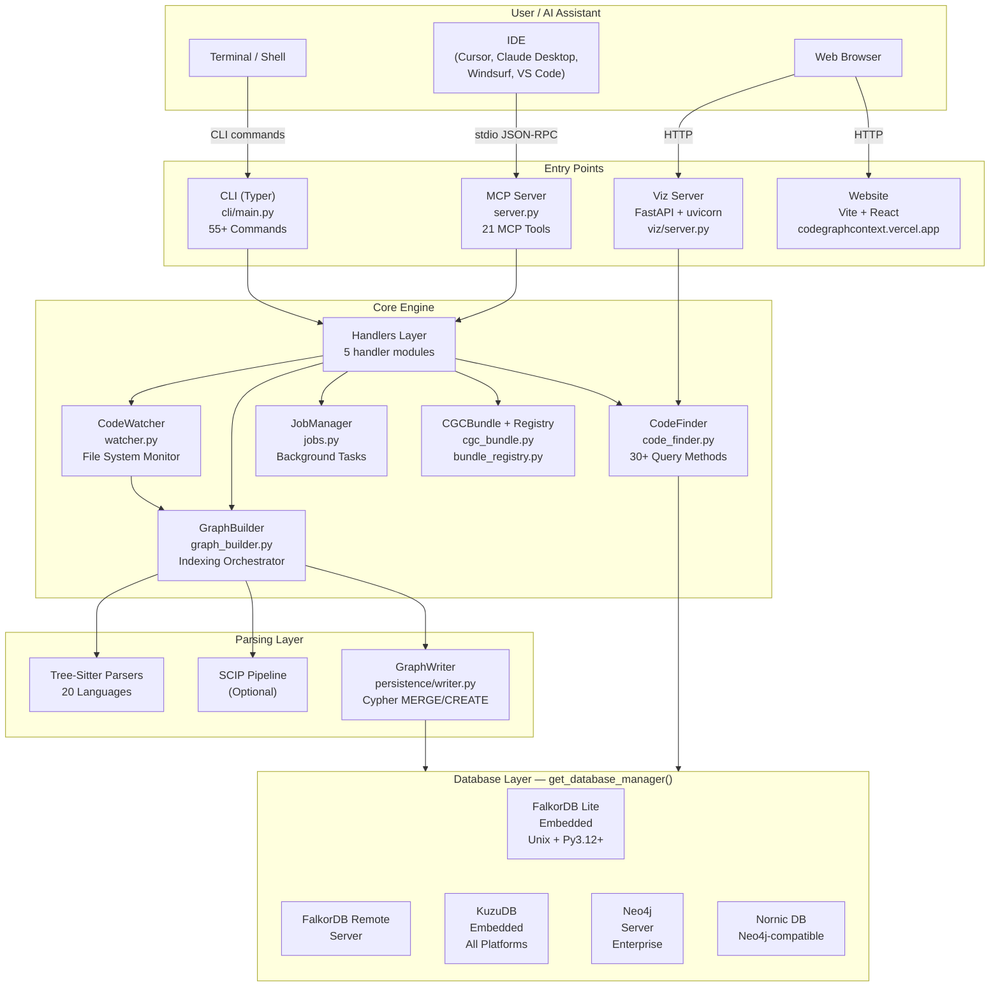

### 2.2 Class Diagram — Core Classes (UML)

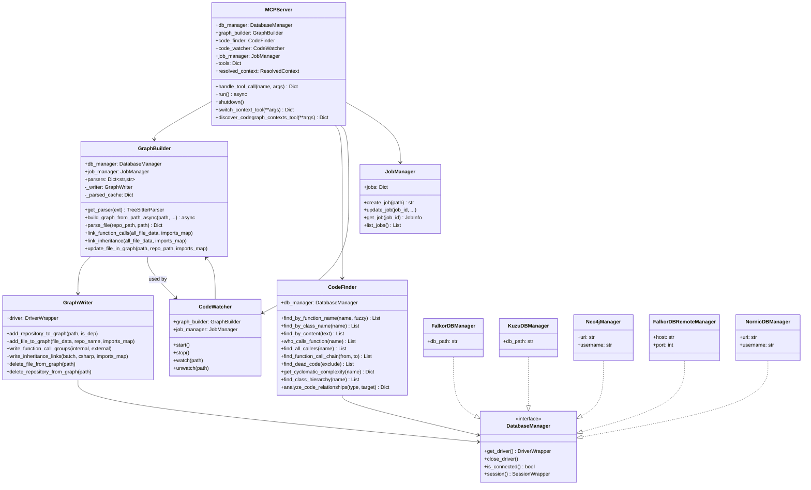

### 2.3 Deployment Diagram

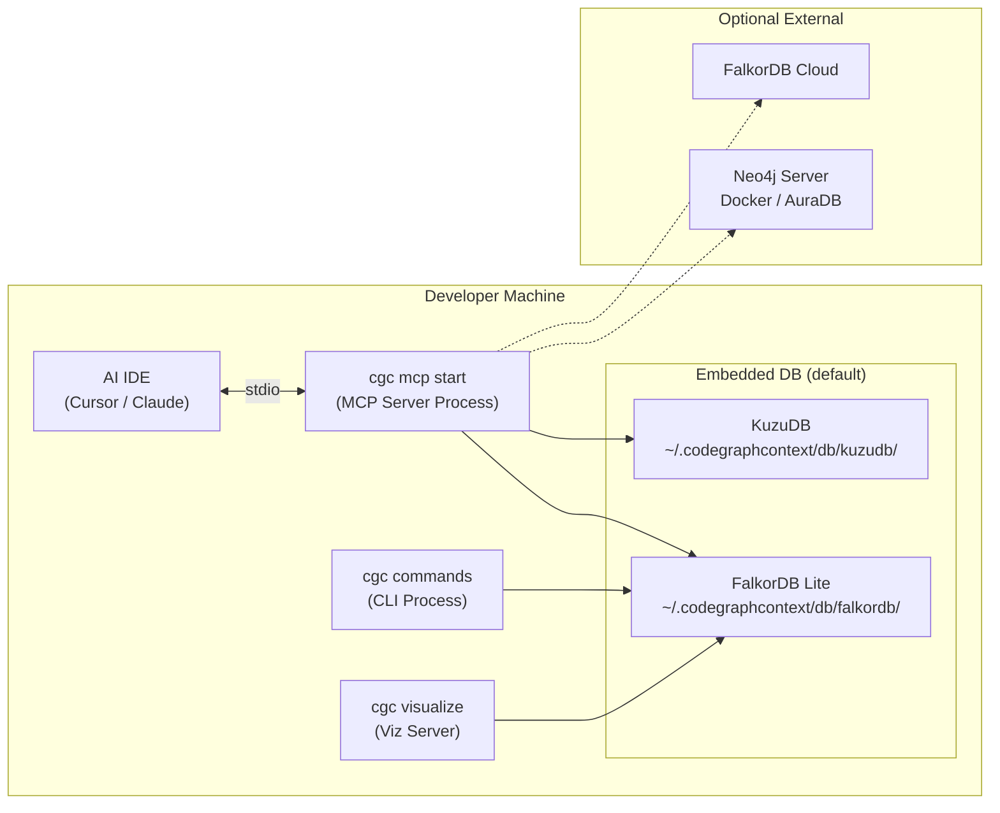

---

## 3. Component Breakdown

### 3.1 MCP Server (JSON-RPC)

**File:** `src/codegraphcontext/server.py` (472 lines)

The MCP Server is the primary interface for AI assistants. It implements a **JSON-RPC 2.0** protocol over **stdin/stdout**.

**JSON-RPC Loop (State Machine):**

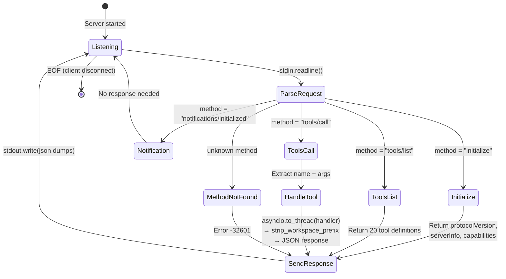

**Illustrative JSON-RPC exchange:**

```json
// → Client sends (stdin):
{"jsonrpc":"2.0","id":1,"method":"initialize","params":{}}

// ← Server responds (stdout):
{"jsonrpc":"2.0","id":1,"result":{"protocolVersion":"2025-03-26","serverInfo":{"name":"CodeGraphContext","version":"0.4.15"},"capabilities":{"tools":{"listTools":true}}}}

// → Client sends:
{"jsonrpc":"2.0","id":2,"method":"tools/call","params":{"name":"find_code","arguments":{"query":"authenticate"}}}

// ← Server responds:
{"jsonrpc":"2.0","id":2,"result":{"content":[{"type":"text","text":"{\"results\":[{\"name\":\"authenticate\",\"path\":\"/src/auth.py\",\"line_number\":15}]}"}]}}
```

**Initialization sequence:**

1. `resolve_context(cwd)` — find `.codegraphcontext/` config
2. `get_database_manager(db_path)` — select and connect database backend
3. `JobManager()` — in-memory job tracker
4. `GraphBuilder(db_manager, job_manager, loop)` — indexing engine
5. `CodeFinder(db_manager)` — query engine
6. `CodeWatcher(graph_builder, job_manager)` — filesystem watcher
7. `_init_tools()` — register 21 MCP tool definitions

**21 Registered MCP Tools:**

| Category | Tools |
|----------|-------|
| **Indexing** | `add_code_to_graph`, `add_package_to_graph`, `watch_directory` |
| **Query** | `execute_cypher_query`, `visualize_graph_query` |
| **Analysis** | `find_code`, `analyze_code_relationships`, `find_dead_code`, `calculate_cyclomatic_complexity`, `find_most_complex_functions` |
| **Management** | `list_indexed_repositories`, `delete_repository`, `check_job_status`, `list_jobs`, `get_repository_stats` |
| **Bundles** | `load_bundle`, `search_registry_bundles` |
| **Watcher** | `list_watched_paths`, `unwatch_directory` |
| **Context** | `discover_codegraph_contexts`, `switch_context` |

**Context discovery feature:** On startup, if no local DB exists, the server scans child directories for `.codegraphcontext/` folders. It appends a `_context_discovery_note` to the first tool response to guide the AI to `switch_context`.

---

### 3.2 CLI (Typer)

**File:** `src/codegraphcontext/cli/main.py` (2386 lines)

The CLI is organized into **subcommand groups** using Typer:

```
cgc
├── index <path>              # Index a repository
├── list / ls                 # List indexed repos
├── delete / rm <repo>        # Delete from graph
├── stats                     # Show stats
├── clean                     # Cleanup
├── query <cypher>            # Run Cypher query
├── visualize / v             # Launch viz server
├── watch / w <path>          # Watch directory
├── unwatch <path>            # Stop watching
├── watching                  # List watched paths
├── doctor                    # Health check
├── version                   # Show version
├── help                      # Help
│
├── mcp
│   ├── setup                 # MCP setup wizard
│   ├── start                 # Start MCP server
│   └── tools                 # List MCP tools
│
├── neo4j
│   └── setup                 # Neo4j setup wizard
│
├── context
│   ├── list                  # List contexts
│   ├── create                # Create named context
│   ├── delete                # Delete context
│   ├── mode                  # Switch global/per-repo
│   └── default               # Set default
│
├── config
│   ├── show                  # Show config
│   ├── set <key> <value>     # Set config value
│   ├── reset                 # Reset to defaults
│   └── db <backend>          # Switch database backend
│
├── bundle
│   ├── export                # Export .cgc bundle
│   ├── import                # Import .cgc bundle
│   └── load                  # Load from registry
│
├── registry
│   ├── list                  # List bundles
│   ├── search <query>        # Search bundles
│   ├── download <name>       # Download bundle
│   └── request <url>         # Request on-demand bundle
│
├── find
│   ├── name <query>          # Find by name
│   ├── pattern <regex>       # Find by pattern
│   ├── type <node_type>      # Find by type
│   ├── variable <name>       # Find variables
│   ├── content <text>        # Full-text search
│   ├── decorator <name>      # Find by decorator
│   └── argument <name>       # Find by argument
│
└── analyze
    ├── calls <function>      # What does it call
    ├── callers <function>    # Who calls it
    ├── chain <from> <to>     # Call chain
    ├── dependencies <module> # Module deps
    ├── inheritance <class>   # Class hierarchy
    ├── complexity <func>     # Cyclomatic complexity
    ├── dead-code             # Find dead code
    ├── overrides <class>     # Method overrides
    └── variable-usage <var>  # Variable scope
```

**Supporting CLI modules:**

| File | Lines | Role |
|------|-------|------|
| `cli/config_manager.py` | 1052 | Config YAML, contexts, workspace mappings, `.env` merge |
| `cli/cli_helpers.py` | 775 | Shared DB init, indexing with progress bars, viz launch |
| `cli/setup_wizard.py` | 992 | Interactive Neo4j + MCP IDE setup (InquirerPy prompts) |
| `cli/registry_commands.py` | 404 | Bundle registry HTTP client |
| `cli/visualizer.py` | 51 | Thin wrappers for browser visualization |
| `cli/setup_macos.py` | 94 | macOS-specific Neo4j homebrew setup |

---

### 3.3 Database Layer

**Directory:** `src/codegraphcontext/core/`

```
┌─────────────────────────────────────────────────────────┐
│                get_database_manager()                     │
│                core/__init__.py (166 lines)               │
│                                                          │
│  Selection Priority:                                     │
│  1. CGC_RUNTIME_DB_TYPE env (CLI --database flag)        │
│  2. DEFAULT_DATABASE env (cgc config db)                 │
│  3. Implicit auto-detection:                             │
│     a. FALKORDB_HOST set → FalkorDB Remote               │
│     b. Unix + Py3.12+ → FalkorDB Lite                   │
│     c. KuzuDB installed → KuzuDB                        │
│     d. Neo4j credentials → Neo4j                        │
└─────────────────────────────────────────────────────────┘
```

| Backend | File | Lines | Engine | Platform |
|---------|------|-------|--------|----------|
| FalkorDB Lite | `database_falkordb.py` | 481 | Embedded via `redislite` + `falkordb` | Unix, Python 3.12+ |
| FalkorDB Remote | `database_falkordb_remote.py` | 200 | Remote FalkorDB server | Any (needs `FALKORDB_HOST`) |
| KuzuDB | `database_kuzu.py` | 627 | Embedded Kuzu | All platforms (Windows default) |
| Neo4j | `database.py` | 274 | Neo4j server (bolt) | Any (needs credentials) |
| Nornic DB | `database_nornic.py` | 180 | Neo4j-compatible Nornic DB | Any (needs credentials) |

All backends implement a **common compatibility interface**: `get_driver()`, `close_driver()`, `is_connected()`, `session()` context manager, with wrapper classes (`DriverWrapper`, `SessionWrapper`, `RecordWrapper`, `ResultWrapper`) to normalize Cypher result access.

---

### 3.4 Indexing Pipeline

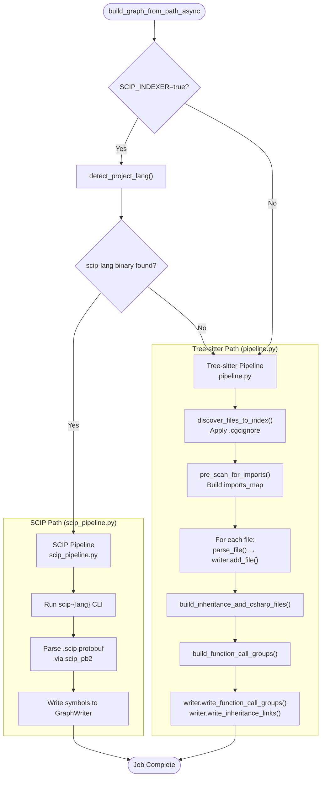

**Indexing submodules:**

| File | Lines | Role |
|------|-------|------|
| `indexing/pipeline.py` | 90 | Tree-sitter full-repo orchestrator |
| `indexing/scip_pipeline.py` | 141 | SCIP full-repo orchestrator |
| `indexing/discovery.py` | 65 | File discovery with `.cgcignore` support |
| `indexing/pre_scan.py` | 106 | Pre-scan files for import maps |
| `indexing/schema.py` | 80 | Graph schema creation (indexes, constraints) |
| `indexing/schema_contract.py` | 45 | Canonical node/relationship definitions |
| `indexing/constants.py` | 26 | Default ignore patterns |
| `indexing/sanitize.py` | 42 | Property sanitization (max string length) |
| `indexing/persistence/writer.py` | 689 | **GraphWriter** — all Cypher MERGE/CREATE operations |
| `indexing/resolution/calls.py` | 205 | Function call resolution (local vs imported) |
| `indexing/resolution/inheritance.py` | 92 | Inheritance + C# `IMPLEMENTS` resolution |

---

### 3.5 Tree-Sitter Parsers

**Directory:** `src/codegraphcontext/tools/languages/`

Each parser follows a consistent pattern:
- Class: `{Language}TreeSitterParser`
- Method: `parse(path, is_dependency, **kwargs) -> Dict`
- Module function: `pre_scan_{language}(...)` for import map building

```
┌────────────────────────────────────────────────────────────────┐
│                    19 Language Parsers                          │
│                                                                │
│  ┌─────────┐ ┌────────────┐ ┌────────────┐ ┌───────────────┐  │
│  │ Python  │ │ JavaScript │ │ TypeScript │ │ TSX           │  │
│  │ 576 ln  │ │ 590 ln     │ │ 576 ln     │ │ 152 ln        │  │
│  └─────────┘ └────────────┘ └────────────┘ │ (extends TS)  │  │
│                                            └───────────────┘  │
│  ┌─────────┐ ┌────────────┐ ┌────────────┐ ┌───────────────┐  │
│  │ Go      │ │ Rust       │ │ C          │ │ C++           │  │
│  │ 508 ln  │ │ 296 ln     │ │ 563 ln     │ │ 616 ln        │  │
│  └─────────┘ └────────────┘ └────────────┘ └───────────────┘  │
│                                                                │
│  ┌─────────┐ ┌────────────┐ ┌────────────┐ ┌───────────────┐  │
│  │ Java    │ │ Ruby       │ │ C#         │ │ Kotlin        │  │
│  │ 471 ln  │ │ 537 ln     │ │ 551 ln     │ │ 640 ln        │  │
│  └─────────┘ └────────────┘ └────────────┘ └───────────────┘  │
│                                                                │
│  ┌─────────┐ ┌────────────┐ ┌────────────┐ ┌───────────────┐  │
│  │ Scala   │ │ Swift      │ │ PHP        │ │ Dart          │  │
│  │ 520 ln  │ │ 491 ln     │ │ 520 ln     │ │ 378 ln        │  │
│  └─────────┘ └────────────┘ └────────────┘ └───────────────┘  │
│                                                                │
│  ┌─────────┐ ┌────────────┐ ┌────────────┐                    │
│  │ Perl    │ │ Haskell    │ │ Elixir     │                    │
│  │ 261 ln  │ │ 427 ln     │ │ 461 ln     │                    │
│  └─────────┘ └────────────┘ └────────────┘                    │
└────────────────────────────────────────────────────────────────┘
```

**File extension mapping** (from `graph_builder.py`):

| Extension(s) | Language | Parser Class |
|--------------|----------|-------------|
| `.py`, `.ipynb` | Python | `PythonTreeSitterParser` |
| `.js`, `.jsx`, `.mjs`, `.cjs` | JavaScript | `JavascriptTreeSitterParser` |
| `.ts` | TypeScript | `TypescriptTreeSitterParser` |
| `.tsx` | TSX | `TypescriptJSXTreeSitterParser` |
| `.go` | Go | `GoTreeSitterParser` |
| `.rs` | Rust | `RustTreeSitterParser` |
| `.c` | C | `CTreeSitterParser` |
| `.cpp`, `.h`, `.hpp`, `.hh` | C++ | `CppTreeSitterParser` |
| `.java` | Java | `JavaTreeSitterParser` |
| `.rb` | Ruby | `RubyTreeSitterParser` |
| `.cs` | C# | `CSharpTreeSitterParser` |
| `.php` | PHP | `PhpTreeSitterParser` |
| `.kt` | Kotlin | `KotlinTreeSitterParser` |
| `.scala`, `.sc` | Scala | `ScalaTreeSitterParser` |
| `.swift` | Swift | `SwiftTreeSitterParser` |
| `.hs` | Haskell | `HaskellTreeSitterParser` |
| `.dart` | Dart | `DartTreeSitterParser` |
| `.pl`, `.pm` | Perl | `PerlTreeSitterParser` |
| `.ex`, `.exs` | Elixir | `ElixirTreeSitterParser` |
| `.lua` | Lua | `LuaTreeSitterParser` |

**Each parser extracts:**
- Functions (name, parameters, return type, decorators, line numbers, source)
- Classes (name, bases, methods, properties, line numbers)
- Imports / modules
- Variables (language-dependent)
- Language-specific nodes (structs, enums, traits, interfaces, macros, etc.)

---

### 3.6 SCIP Pipeline

**Files:** `tools/scip_indexer.py` (468 lines), `tools/scip_pb2.py` (2456 lines, generated), `indexing/scip_pipeline.py` (141 lines)

```
┌──────────────────────────────────────────────────────┐
│               SCIP Indexing Path                      │
│                                                      │
│  Enabled via: SCIP_INDEXER=true in config            │
│  Languages:   SCIP_LANGUAGES (default: python,       │
│               typescript, go, rust, java)             │
│                                                      │
│  1. detect_project_lang() ─── scan for markers       │
│     (setup.py, package.json, go.mod, Cargo.toml)     │
│                                                      │
│  2. is_scip_available(lang) ─── check `scip-*` CLI   │
│                                                      │
│  3. ScipIndexer.index(path) ─── run CLI, get .scip   │
│                                                      │
│  4. ScipIndexParser.parse(scip_file) ─── decode       │
│     protobuf via scip_pb2                            │
│                                                      │
│  5. Write symbols to GraphWriter                     │
│                                                      │
│  Fallback: If no scip-* binary found → Tree-sitter   │
└──────────────────────────────────────────────────────┘
```

---

### 3.7 Query & Analysis (CodeFinder)

**File:** `tools/code_finder.py` (1119 lines)

The `CodeFinder` class is the read-side of the graph. It generates and executes Cypher queries across all backends.

**Query methods organized by category:**

```
┌────────────────────────────────────────────────────────────┐
│                     CodeFinder                              │
│                                                            │
│  SEARCH:                                                   │
│  ├── find_by_function_name(name, fuzzy, edit_distance)     │
│  ├── find_by_class_name(name, fuzzy, edit_distance)        │
│  ├── find_by_variable_name(name)                           │
│  ├── find_by_module_name(name)                             │
│  ├── find_by_content(text)                                 │
│  ├── find_by_type(node_type)                               │
│  ├── find_functions_by_argument(arg_name)                  │
│  ├── find_functions_by_decorator(decorator)                │
│  └── find_imports(module)                                  │
│                                                            │
│  CALL GRAPH:                                               │
│  ├── who_calls_function(name)                              │
│  ├── what_does_function_call(name)                         │
│  ├── find_all_callers(name) — transitive                   │
│  ├── find_all_callees(name) — transitive                   │
│  └── find_function_call_chain(from, to)                    │
│                                                            │
│  INHERITANCE:                                              │
│  ├── find_class_hierarchy(class_name)                      │
│  └── find_function_overrides(class_name)                   │
│                                                            │
│  ANALYSIS:                                                 │
│  ├── find_dead_code(exclude_decorated_with)                │
│  ├── get_cyclomatic_complexity(function_name)              │
│  ├── find_most_complex_functions(limit)                    │
│  ├── find_module_dependencies(module)                      │
│  ├── find_variable_usage_scope(variable)                   │
│  ├── who_modifies_variable(variable)                       │
│  ├── who_imports_module(module)                            │
│  └── analyze_code_relationships(query_type, target)        │
│                                                            │
│  MANAGEMENT:                                               │
│  └── list_indexed_repositories()                           │
│                                                            │
│  FUZZY SEARCH:                                             │
│  └── _find_by_name_fuzzy_portable(name, label, dist)      │
│      (Levenshtein distance, no DB extension needed)        │
└────────────────────────────────────────────────────────────┘
```

Also: `tools/advanced_language_query_tool.py` (104 lines) routes queries to per-language `*Toolkit` classes under `query_tool_languages/`, but **all 16 toolkits currently raise `NotImplementedError`**.

---

### 3.8 Handlers Layer

**Directory:** `src/codegraphcontext/tools/handlers/`

Handlers sit between the MCP Server/CLI and the core tools. They handle argument parsing, error wrapping, and response formatting.

```
┌────────────────────────────────────────────────────┐
│  MCP Server tool_map / CLI commands                 │
│           │                                        │
│           ▼                                        │
│  ┌──────────────────────┐                          │
│  │ analysis_handlers.py │  find_dead_code,         │
│  │ (115 lines)          │  cyclomatic_complexity,  │
│  │                      │  find_code, etc.         │
│  ├──────────────────────┤                          │
│  │ indexing_handlers.py  │  add_code_to_graph,     │
│  │ (117 lines)          │  add_package_to_graph    │
│  ├──────────────────────┤                          │
│  │ management_handlers.py│ list_repos, delete,     │
│  │ (340 lines)          │  load_bundle, stats,    │
│  │                      │  search_registry        │
│  ├──────────────────────┤                          │
│  │ query_handlers.py    │  execute_cypher,         │
│  │ (84 lines)           │  visualize_graph         │
│  ├──────────────────────┤                          │
│  │ watcher_handlers.py  │  watch, unwatch, list    │
│  │ (84 lines)           │                          │
│  └──────────────────────┘                          │
└────────────────────────────────────────────────────┘
```

---

### 3.9 Bundles & Registry

```
┌────────────────────────────────────────────────────────────┐
│                   Bundle System                             │
│                                                            │
│  EXPORT: cgc bundle export                                 │
│  ┌─────────────────────────────────────┐                   │
│  │ CGCBundle.export()                  │                   │
│  │ core/cgc_bundle.py (858 lines)     │                   │
│  │                                     │                   │
│  │ 1. Query all graph data             │                   │
│  │ 2. JSON serialize (nodes + edges)   │                   │
│  │ 3. ZIP into .cgc file               │                   │
│  │ 4. Include metadata.json            │                   │
│  └─────────────────────────────────────┘                   │
│                                                            │
│  IMPORT: cgc bundle import / cgc load                      │
│  ┌─────────────────────────────────────┐                   │
│  │ CGCBundle.import()                  │                   │
│  │                                     │                   │
│  │ 1. Unzip .cgc file                  │                   │
│  │ 2. Read metadata.json               │                   │
│  │ 3. Merge nodes + edges into DB      │                   │
│  └─────────────────────────────────────┘                   │
│                                                            │
│  REGISTRY: cgc registry list/search/download               │
│  ┌─────────────────────────────────────┐                   │
│  │ BundleRegistry                      │                   │
│  │ core/bundle_registry.py (182 lines)│                   │
│  │                                     │                   │
│  │ HTTP client → GitHub Releases API   │                   │
│  │ + on-demand bundle trigger          │                   │
│  └─────────────────────────────────────┘                   │
│                                                            │
│  ON-DEMAND (Website):                                      │
│  ┌─────────────────────────────────────┐                   │
│  │ website/api/trigger-bundle.ts       │                   │
│  │ website/api/bundle-status.ts        │                   │
│  │ website/api/bundles.ts              │                   │
│  │                                     │                   │
│  │ GitHub Actions workflow dispatch    │                   │
│  │ → builds bundle → GitHub Release   │                   │
│  └─────────────────────────────────────┘                   │
└────────────────────────────────────────────────────────────┘
```

---

### 3.10 File Watcher

**File:** `core/watcher.py` (261 lines)

```
┌────────────────────────────────────────────────┐
│              CodeWatcher                        │
│                                                │
│  Uses: watchdog (FileSystemEventHandler)       │
│                                                │
│  1. start() — launch observer thread           │
│  2. watch(path) — add directory to observer    │
│  3. RepositoryEventHandler:                    │
│     on_modified/created/deleted →              │
│     debounced → graph_builder.update_file()    │
│  4. stop() — halt observer                     │
│                                                │
│  Integrates with:                              │
│  - GraphBuilder for incremental updates        │
│  - JobManager for tracking re-index jobs       │
└────────────────────────────────────────────────┘
```

---

### 3.11 Visualization Server

**File:** `viz/server.py` (283 lines)

```
┌──────────────────────────────────────────────────┐
│            Viz Server (FastAPI + Uvicorn)          │
│                                                   │
│  Routes:                                          │
│  GET /           → static viz/dist/ (React SPA)   │
│  GET /api/graph  → Cypher proxy → JSON response   │
│  GET /*          → static file fallback            │
│                                                   │
│  Launched via: cgc visualize / cgc v               │
│  Opens browser to: http://localhost:PORT           │
│                                                   │
│  The static dist/ is the built CodeGraphViewer     │
│  packaged into the Python wheel.                  │
└──────────────────────────────────────────────────┘
```

---

### 3.12 Website & CodeGraphViewer

**Directory:** `website/` (Vite + React + TypeScript + shadcn/ui)

```
┌─────────────────────────────────────────────────────────────────┐
│                     Website Architecture                         │
│                                                                 │
│  PAGES:                                                         │
│  ┌──────────────┐  ┌──────────────┐  ┌─────────────────────┐   │
│  │ Index (/)    │  │ Explore      │  │ NotFound (404)      │   │
│  │ Landing page │  │ /explore     │  │                     │   │
│  │ 8 sections   │  │ Graph viewer │  │                     │   │
│  └──────────────┘  └──────┬───────┘  └─────────────────────┘   │
│                           │                                     │
│  CORE COMPONENTS:         ▼                                     │
│  ┌────────────────────────────────────────────┐                 │
│  │ CodeGraphViewer.tsx (1579 lines)           │                 │
│  │                                            │                 │
│  │ Visualization modes:                       │                 │
│  │ ┌──────────┐ ┌──────────┐ ┌─────────────┐ │                 │
│  │ │ 2D Force │ │ 3D Force │ │ 3D City     │ │                 │
│  │ │ Graph    │ │ Graph    │ │ Treemap     │ │                 │
│  │ └──────────┘ └──────────┘ └─────────────┘ │                 │
│  │ ┌──────────┐ ┌─────────────────────────┐  │                 │
│  │ │ Mermaid  │ │ Themes: Classic, Icon,  │  │                 │
│  │ │ Flowchart│ │ Neon, Galaxy            │  │                 │
│  │ └──────────┘ └─────────────────────────┘  │                 │
│  │                                            │                 │
│  │ Features:                                  │                 │
│  │ - Resizable sidebar with file tree         │                 │
│  │ - Node/edge color customization            │                 │
│  │ - Node type visibility toggles             │                 │
│  │ - File source code viewer with highlights  │                 │
│  │ - Search & filter                          │                 │
│  │ - Focus mode (file-centric highlight)      │                 │
│  └────────────────────────────────────────────┘                 │
│                                                                 │
│  IN-BROWSER PARSING:                                            │
│  ┌────────────────────────────────────────────┐                 │
│  │ parser.worker.ts (798 lines)               │                 │
│  │ Web Worker using web-tree-sitter WASM      │                 │
│  │                                            │                 │
│  │ 1. User uploads files / pastes GitHub URL  │                 │
│  │ 2. Worker initializes Tree-sitter          │                 │
│  │ 3. Parses each file → AST → symbols        │                 │
│  │ 4. Builds graph (nodes + links)            │                 │
│  │ 5. Posts DONE message with graph data      │                 │
│  │ 6. CodeGraphViewer renders                 │                 │
│  └────────────────────────────────────────────┘                 │
│                                                                 │
│  API ROUTES (Vercel serverless):                                │
│  ├── /api/bundles         → GitHub releases list                │
│  ├── /api/bundle-status   → GitHub Actions run status           │
│  ├── /api/trigger-bundle  → GitHub workflow dispatch             │
│  ├── /api/pypi            → pypistats proxy                     │
│  └── api/lib/security.js  → Rate limiting + origin checks       │
└─────────────────────────────────────────────────────────────────┘
```

---

## 4. Graph Schema

### 4.1 Entity-Relationship Diagram

```mermaid
erDiagram
    Repository ||--o{ File : CONTAINS
    File ||--o{ Function : CONTAINS
    File ||--o{ Class : CONTAINS
    File ||--o{ Variable : CONTAINS
    File ||--o{ Module : IMPORTS
    Function ||--o{ Function : CALLS
    Function ||--o{ Parameter : HAS_PARAMETER
    Class ||--o{ Class : INHERITS
    Class ||--o{ Interface : IMPLEMENTS
    File ||--o{ File : INCLUDES

    Repository {
        string path PK
        string name
        boolean is_dependency
    }
    File {
        string path PK
        string name
        string lang
        string repo_path
    }
    Function {
        string name
        string path
        int line_number
        int end_line
        int cyclomatic_complexity
        string source
        string decorators
    }
    Class {
        string name
        string path
        int line_number
        int end_line
        string bases
        string source
    }
    Module {
        string name
        string full_import_name
        string path
    }
    Variable {
        string name
        string path
        int line_number
    }
```

### 4.2 Node Labels (17 total)

| Category | Labels | Used By |
|----------|--------|---------|
| **Structural** | `Repository`, `Directory`, `File` | All languages |
| **Core Code** | `Function`, `Class`, `Module`, `Variable` | All languages |
| **Type System** | `Interface`, `Trait`, `Struct`, `Enum`, `Union` | Go, Rust, C/C++, Java, C#, Swift, Kotlin, Haskell |
| **Metadata** | `Record`, `Property`, `Annotation`, `Parameter`, `Macro` | C/C++, Java, Kotlin, Dart, Elixir |

### 4.3 Relationship Types (7)

| Relationship | From → To | Meaning |
|-------------|-----------|---------|
| `CONTAINS` | File → Function/Class/Variable | Code structure ownership |
| `CALLS` | Function → Function | Function invocation |
| `IMPORTS` | File → Module | Dependency usage |
| `INHERITS` | Class → Class | Class inheritance |
| `IMPLEMENTS` | Class → Interface | Interface implementation (C#, Java) |
| `HAS_PARAMETER` | Function → Parameter | Function signature |
| `INCLUDES` | File → File | Header inclusion (C/C++) |

### 4.4 Merge Keys (Identity)

| Entity | Merge Key | Example |
|--------|----------|---------|
| Function | `(name, path, line_number)` | `("authenticate", "/src/auth.py", 15)` |
| Class | `(name, path, line_number)` | `("User", "/src/models.py", 8)` |
| File | `(path,)` | `("/src/auth.py",)` |
| Repository | `(path,)` | `("/home/user/myproject",)` |
| Directory | `(path,)` | `("/home/user/myproject/src",)` |

### 4.5 Illustrative Example — What Gets Indexed

Given this Python file:

```python
# /myproject/src/auth.py
from .models import User
from .utils import hash_password

class AuthService:
    def authenticate(self, username: str, password: str) -> User:
        hashed = hash_password(password)
        user = User.find_by_name(username)
        return user

    def logout(self, user: User):
        user.clear_session()
```

The indexer produces this graph:

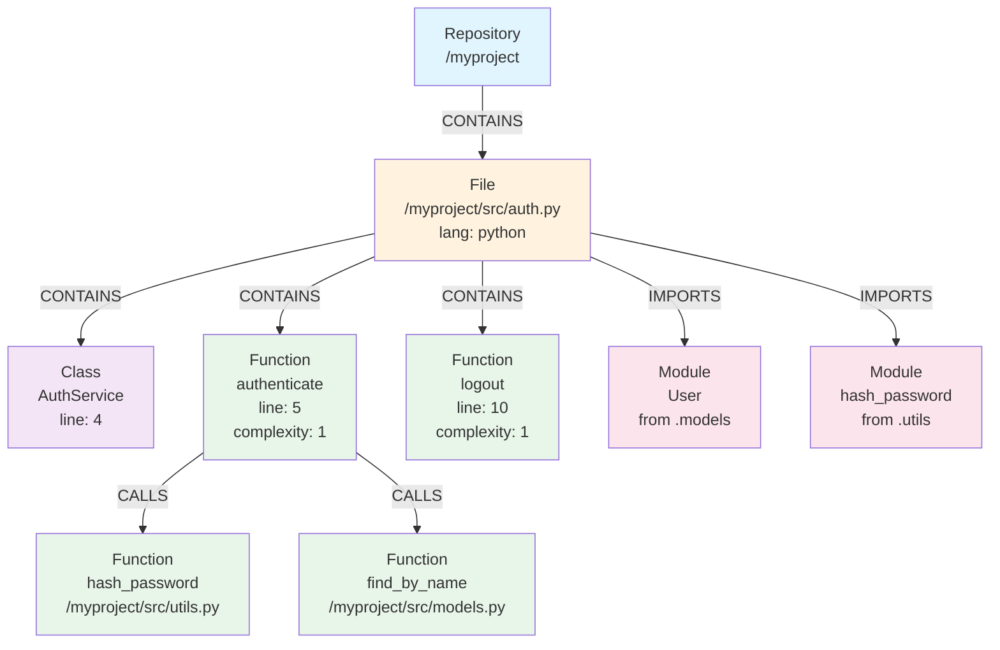

**Example queries against this graph:**

```cypher
-- "Who calls hash_password?"
MATCH (caller:Function)-[:CALLS]->(callee:Function {name: 'hash_password'})
RETURN caller.name, caller.path, caller.line_number
-- Result: authenticate, /myproject/src/auth.py, 5

-- "Find all classes that inherit from BaseModel"
MATCH (c:Class)-[:INHERITS]->(p:Class {name: 'BaseModel'})
RETURN c.name, c.path

-- "Find dead code (functions never called)"
MATCH (f:Function)
WHERE NOT ()-[:CALLS]->(f) AND NOT f.name STARTS WITH '_'
RETURN f.name, f.path, f.line_number
```

---

## 5. Data Flow Diagrams

### 5.1 Sequence Diagram — Indexing a Repository (MCP)

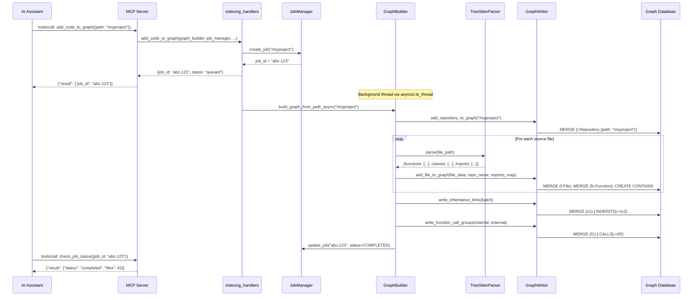

### 5.2 Sequence Diagram — Querying the Graph

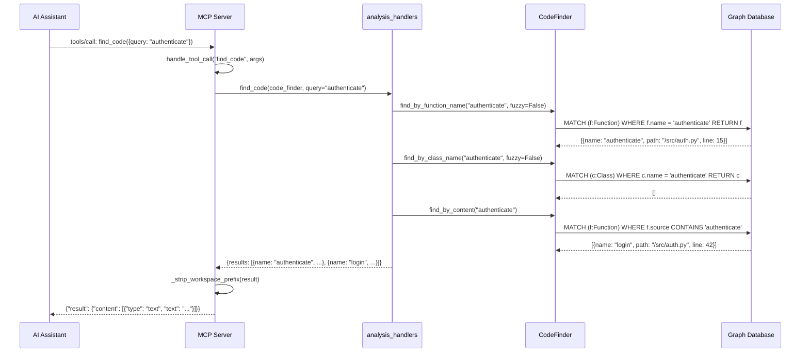

### 5.3 Sequence Diagram — Context Switch

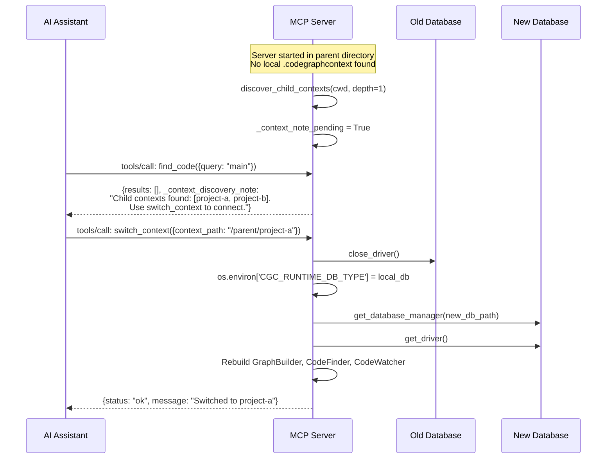

### 5.4 Sequence Diagram — Website In-Browser Parsing

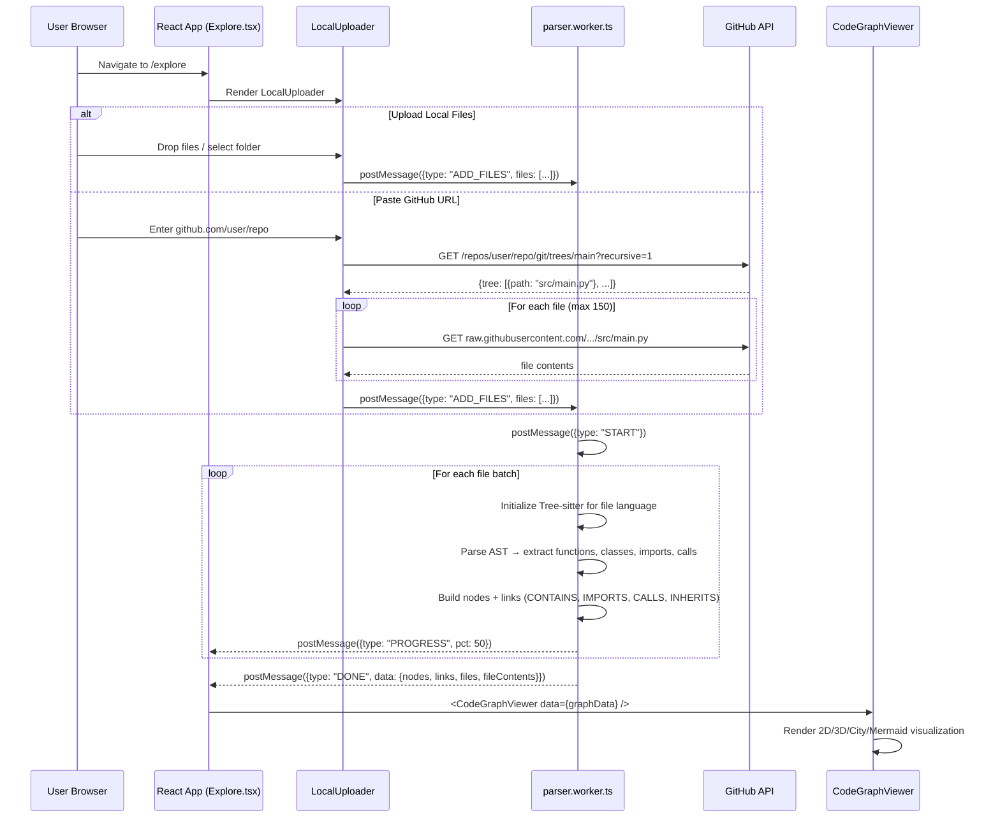

### 5.5 Activity Diagram — Database Selection

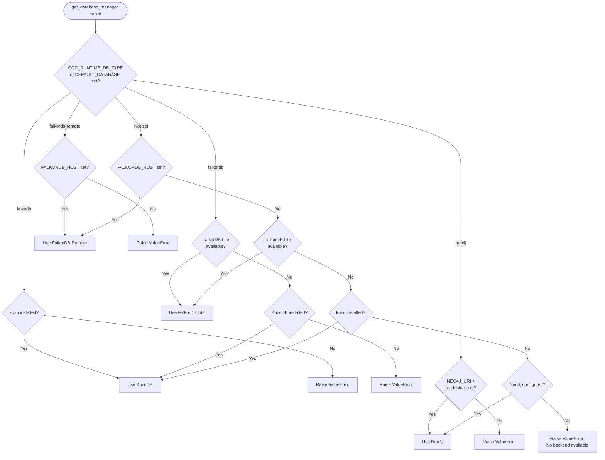

---

## 6. File Tree (Annotated)

```
CodeGraphContext/
├── pyproject.toml                    # Package metadata, deps, scripts (v0.4.15)
├── MANIFEST.in                       # Include viz/dist in sdist
├── Dockerfile                        # Container image
├── docker-compose.yml                # Neo4j 5.21 + app
├── docker-compose.template.yml       # Template with optional profiles
├── .env.example                      # Example environment variables
├── cgc_entry.py                      # Alternative entry point (18 lines)
├── LICENSE                           # MIT
├── README.md                         # Main readme (484 lines)
├── README.{zh-CN,kor,uk,ru-RU}.md   # Localized readmes
│
├── src/codegraphcontext/
│   ├── __init__.py                   # Package marker
│   ├── __main__.py                   # python -m entrypoint
│   ├── server.py                     # MCP Server (472 lines) ★
│   ├── tool_definitions.py           # 20 MCP tool schemas (220 lines)
│   ├── prompts.py                    # LLM system prompt (125 lines)
│   │
│   ├── cli/
│   │   ├── main.py                   # CLI commands (2386 lines) ★
│   │   ├── config_manager.py         # Config + contexts (1052 lines) ★
│   │   ├── cli_helpers.py            # Shared helpers (775 lines)
│   │   ├── setup_wizard.py           # Interactive setup (992 lines)
│   │   ├── registry_commands.py      # Registry HTTP client (404 lines)
│   │   ├── visualizer.py             # Viz wrappers (51 lines)
│   │   └── setup_macos.py            # macOS setup (94 lines)
│   │
│   ├── core/
│   │   ├── __init__.py               # DB factory (166 lines) ★
│   │   ├── database.py               # Neo4j backend (274 lines)
│   │   ├── database_falkordb.py      # FalkorDB Lite (481 lines)
│   │   ├── database_falkordb_remote.py # FalkorDB Remote (200 lines)
│   │   ├── database_kuzu.py          # KuzuDB backend (627 lines)
│   │   ├── jobs.py                   # Job tracking (133 lines)
│   │   ├── watcher.py                # File watcher (261 lines)
│   │   ├── cgcignore.py              # Ignore rules (119 lines)
│   │   ├── cgc_bundle.py             # Bundle export/import (858 lines)
│   │   ├── bundle_registry.py        # Registry client (182 lines)
│   │   └── falkor_worker.py          # Subprocess helper (133 lines)
│   │
│   ├── tools/
│   │   ├── graph_builder.py          # Indexing facade (321 lines) ★
│   │   ├── code_finder.py            # Query engine (1119 lines) ★
│   │   ├── tree_sitter_parser.py     # Parser dispatch (~75 lines)
│   │   ├── package_resolver.py       # Package path resolution (473 lines)
│   │   ├── scip_indexer.py           # SCIP CLI runner (468 lines)
│   │   ├── scip_pb2.py              # Generated protobuf (2456 lines)
│   │   ├── system.py                 # System tools (134 lines)
│   │   ├── advanced_language_query_tool.py # (104 lines, stubs)
│   │   │
│   │   ├── indexing/
│   │   │   ├── pipeline.py           # Tree-sitter pipeline (90 lines)
│   │   │   ├── scip_pipeline.py      # SCIP pipeline (141 lines)
│   │   │   ├── discovery.py          # File discovery (65 lines)
│   │   │   ├── pre_scan.py           # Import pre-scanning (106 lines)
│   │   │   ├── schema.py             # Schema creation (80 lines)
│   │   │   ├── schema_contract.py    # Node/relationship contract (45 lines)
│   │   │   ├── constants.py          # Ignore patterns (26 lines)
│   │   │   ├── sanitize.py           # Property sanitization (42 lines)
│   │   │   ├── persistence/
│   │   │   │   └── writer.py         # GraphWriter (689 lines) ★
│   │   │   └── resolution/
│   │   │       ├── calls.py          # Call resolution (205 lines)
│   │   │       └── inheritance.py    # Inheritance resolution (92 lines)
│   │   │
│   │   ├── handlers/
│   │   │   ├── analysis_handlers.py  # (115 lines)
│   │   │   ├── indexing_handlers.py  # (117 lines)
│   │   │   ├── management_handlers.py# (340 lines)
│   │   │   ├── query_handlers.py     # (84 lines)
│   │   │   └── watcher_handlers.py   # (84 lines)
│   │   │
│   │   ├── languages/                # 19 Tree-sitter parsers
│   │   │   ├── python.py (576)       ├── javascript.py (590)
│   │   │   ├── typescript.py (576)   ├── typescriptjsx.py (152)
│   │   │   ├── go.py (508)           ├── rust.py (296)
│   │   │   ├── c.py (563)            ├── cpp.py (616)
│   │   │   ├── java.py (471)         ├── ruby.py (537)
│   │   │   ├── csharp.py (551)       ├── php.py (520)
│   │   │   ├── kotlin.py (640)       ├── scala.py (520)
│   │   │   ├── swift.py (491)        ├── dart.py (378)
│   │   │   ├── perl.py (261)         ├── haskell.py (427)
│   │   │   └── elixir.py (461)
│   │   │
│   │   └── query_tool_languages/     # 16 stub toolkits (all NotImplementedError)
│   │
│   ├── utils/
│   │   ├── tree_sitter_manager.py    # Language loading (~265 lines)
│   │   ├── debug_log.py              # Logging utilities (91 lines)
│   │   ├── path_ignore.py            # Path ignore helpers (55 lines)
│   │   └── repo_path.py              # Path matching (27 lines)
│   │
│   └── viz/
│       ├── server.py                 # FastAPI viz server (283 lines)
│       └── dist/                     # Built React visualization (packaged)
│
├── tests/
│   ├── conftest.py                   # Session fixtures
│   ├── unit/                         # Unit tests
│   │   ├── core/                     # DB, jobs, cgcignore tests
│   │   ├── tools/                    # GraphBuilder, CodeFinder tests
│   │   ├── parsers/                  # Language parser tests
│   │   ├── languages/                # Language-specific tests
│   │   └── utils/                    # Utility tests
│   ├── integration/
│   │   ├── cli/                      # CLI command tests
│   │   └── mcp/                      # MCP server tests
│   ├── e2e/                          # User journey tests
│   ├── perf/                         # Performance tests
│   └── fixtures/                     # Sample projects (multi-language)
│
├── website/                          # Vite + React + shadcn/ui
│   ├── src/
│   │   ├── components/
│   │   │   ├── CodeGraphViewer.tsx    # Main viewer (1579 lines) ★
│   │   │   ├── FlowchartSVG.tsx      # Mermaid-style SVG (662 lines)
│   │   │   ├── LocalUploader.tsx     # File upload (245 lines)
│   │   │   ├── BundleGeneratorSection.tsx
│   │   │   ├── BundleRegistrySection.tsx
│   │   │   └── ui/                   # ~50 shadcn components
│   │   ├── lib/
│   │   │   ├── parser.ts             # Parse orchestrator (105 lines)
│   │   │   └── parser.worker.ts      # Web Worker parser (798 lines) ★
│   │   └── pages/
│   │       ├── Index.tsx             # Landing page
│   │       ├── Explore.tsx           # Graph explorer
│   │       └── NotFound.tsx
│   └── api/                          # Vercel serverless routes
│       ├── bundles.ts
│       ├── bundle-status.ts
│       ├── trigger-bundle.ts
│       └── pypi.ts
│
├── docs/                             # MkDocs documentation
│   ├── mkdocs.yml
│   ├── docs/                         # Source markdown (44 pages)
│   └── site/                         # Built static site
│
├── k8s/                              # Kubernetes manifests
├── scripts/                          # Dev/ops scripts
├── organizer/                        # Internal planning notes
└── .github/workflows/                # CI/CD (8 workflows)
```

---

## 7. Complete Feature Inventory

### Shipped and Working

| # | Feature | Component | Status |
|---|---------|-----------|--------|
| 1 | MCP Server (JSON-RPC over stdio) | `server.py` | Stable |
| 2 | 20 MCP tools | `tool_definitions.py` + handlers | Stable |
| 3 | CLI with 55+ commands | `cli/main.py` | Stable |
| 4 | FalkorDB Lite embedded backend | `database_falkordb.py` | Stable (Unix, Py3.12+) |
| 5 | FalkorDB Remote backend | `database_falkordb_remote.py` | Stable |
| 6 | KuzuDB embedded backend | `database_kuzu.py` | Stable |
| 7 | Neo4j server backend | `database.py` | Stable |
| 8 | 20 language parsers (Tree-sitter) | `languages/*.py` | Stable |
| 9 | Python, JS, TS, Go, Rust, C, C++, Java, Ruby, C#, PHP, Kotlin, Scala, Swift, Dart, Perl, Haskell, Elixir, TSX, Lua | | |
| 10 | Jupyter notebook parsing | Python parser + `nbformat` | Stable |
| 11 | SCIP indexing (opt-in) | `scip_indexer.py`, `scip_pipeline.py` | Beta |
| 12 | Graph schema: 17 node types, 7 relationships | `schema_contract.py` | Stable |
| 13 | Fuzzy search (Levenshtein) | `code_finder.py` | Stable |
| 14 | Cyclomatic complexity analysis | `code_finder.py` | Stable |
| 15 | Dead code detection | `code_finder.py` | Stable |
| 16 | Call chain analysis (transitive) | `code_finder.py` | Stable |
| 17 | Class inheritance hierarchy | `code_finder.py` | Stable |
| 18 | File system watcher (live re-index) | `watcher.py` | Stable |
| 19 | `.cgcignore` support | `cgcignore.py` | Stable |
| 20 | Bundle export/import (.cgc format) | `cgc_bundle.py` | Stable |
| 21 | Bundle registry (GitHub-backed) | `bundle_registry.py` | Stable |
| 22 | On-demand bundle generation (website) | `api/trigger-bundle.ts` | Stable |
| 23 | Named contexts (global/per-repo) | `config_manager.py` | Stable |
| 24 | Context discovery + switch (MCP) | `server.py` | Stable |
| 25 | Workspace mappings (persistent context) | `config_manager.py` | Stable |
| 26 | Interactive setup wizard | `setup_wizard.py` | Stable |
| 27 | Multi-IDE MCP setup (Cursor, Claude, VS Code, JetBrains, Windsurf, etc.) | `setup_wizard.py` | Stable |
| 28 | Visualization server (FastAPI) | `viz/server.py` | Stable |
| 29 | Website with in-browser parsing | `website/` | Stable |
| 30 | CodeGraphViewer (2D/3D/City/Mermaid) | `CodeGraphViewer.tsx` | Stable |
| 31 | GitHub repo parsing in browser | `parser.ts` + `parser.worker.ts` | Stable |
| 32 | Package resolver (9 languages) | `package_resolver.py` | Stable |
| 33 | Source code indexing (opt-in) | `INDEX_SOURCE` config | Stable |
| 34 | Docker deployment | `Dockerfile`, `docker-compose.yml` | Stable |
| 35 | Kubernetes deployment | `k8s/*.yaml` | Template |
| 36 | CI/CD (GitHub Actions) | `.github/workflows/` | Active |
| 37 | Multi-language README | 5 translations | Stable |
| 38 | MkDocs documentation site | `docs/` | Partial |
| 39 | `cgc doctor` health check | `cli/main.py` | Stable |
| 40 | LLM system prompt for graph-aware AI | `prompts.py` | Stable |

### Partially Implemented / Stubbed

| # | Feature | Status | Notes |
|---|---------|--------|-------|
| 41 | Advanced language query toolkits | Stubbed | All 16 `*_toolkit.py` raise `NotImplementedError` |
| 42 | `visualize_graph_query` (Neo4j Browser URL) | Niche | Only works with Neo4j, not embedded backends |
| 43 | `falkor_worker.py` subprocess isolation | Partial | Worker entrypoint exists but integration unclear |

---

## 8. Current Limitations

### Architecture

| # | Limitation | Impact | Severity |
|---|-----------|--------|----------|
| L1 | **Single-process MCP server** — no horizontal scaling; JSON-RPC over stdio ties to one IDE process | Cannot serve multiple IDEs simultaneously | Medium |
| L2 | **Synchronous handlers via `asyncio.to_thread`** — all tool handlers are sync functions wrapped in threads; no true async DB drivers | Thread pool can saturate under heavy concurrent tool calls | Low |
| L3 | **In-memory job tracking** — `JobManager` uses a dict; jobs lost on restart | No job persistence across server restarts | Medium |
| L4 | **No authentication/authorization** — MCP server trusts all stdin input; viz server has no auth | Acceptable for local use; security concern in shared/remote setups | Low (local) |
| L5 | **Monolithic `cli/main.py`** (2386 lines) — all commands in one file | Hard to maintain and test individual command groups | Medium |
| L6 | **Monolithic `code_finder.py`** (1119 lines) — 30+ query methods in one class | Growing complexity; hard to extend per-backend | Medium |
| L7 | **`CodeGraphViewer.tsx`** (1579 lines) — single massive React component | Difficult to maintain; mixing rendering, state, and layout | High |
| L8 | **No streaming for large results** — all query results materialized in memory then JSON-serialized | Memory pressure on large codebases | Medium |

### Database

| # | Limitation | Impact | Severity |
|---|-----------|--------|----------|
| L9 | **FalkorDB Lite requires Unix + Python 3.12+** — no Windows support | Windows users fall back to KuzuDB | Medium |
| L10 | **KuzuDB Cypher dialect differences** — some Cypher constructs (UNWIND, certain aggregations) differ from Neo4j/Falkor | Query compatibility issues; `code_finder.py` has workarounds but not exhaustive | High |
| L11 | **No connection pooling** — single driver instance per backend | Performance ceiling under concurrent queries | Low |
| L12 | **Bundle format tied to Cypher** — export/import uses raw Cypher strings; schema changes break bundles | Forward compatibility risk | Medium |

### Parsing

| # | Limitation | Impact | Severity |
|---|-----------|--------|----------|
| L13 | **Tree-sitter is syntactic, not semantic** — no type inference, no cross-file symbol resolution beyond import maps | Call graph can be imprecise (e.g., same-name functions across modules) | Medium |
| L14 | **SCIP requires external `scip-*` binaries** — not bundled; user must install per-language | Friction for adoption; most users stay on Tree-sitter | Low |
| L15 | **No incremental SCIP indexing** — always full re-index | Slow for large repos when using SCIP | Medium |
| L16 | **`.h` files default to C++ parser** — C projects with `.h` files get C++ parsing | May produce slightly wrong AST for pure C headers | Low |
| L17 | **No HTML/CSS/SQL/Shell/YAML parsing** — only 19 languages | Users of those languages get no graph data | Low |

### Testing

| # | Limitation | Impact | Severity |
|---|-----------|--------|----------|
| L18 | **`test_cgcignore_patterns.py` requires installed CLI + running DB** — not isolated | Flaky in CI without setup | Medium |
| L19 | **Ruby fixture test** (`test_mixins.py`) expects undefined `graph` fixture | Dead test; will fail if collected | Low |
| L20 | **Duplicate C++ enum tests** across `test_cpp_enums.py` and `test_cpp_parser.py` | Drift risk | Low |
| L21 | **E2E tests have weak assertions** — some assertions commented out | False passes | Medium |
| L22 | **Performance test is a mock** — `test_large_indexing.py` doesn't test real perf | No real performance regression detection | Medium |

### Documentation

| # | Limitation | Impact | Severity | Status |
|---|-----------|--------|----------|--------|
| L23 | ~~Docs reference wrong config keys~~ | ~~User confusion~~ | ~~High~~ | **FIXED** (2026-04-09) |
| L24 | ~~Architecture docs show KuzuDB as default~~ | ~~Misleading~~ | ~~High~~ | **FIXED** (2026-04-09) |
| L25 | ~~MCP tools docs missing 2 tools~~ | ~~Undiscoverable features~~ | ~~Medium~~ | **FIXED** (2026-04-09) |
| L26 | ~~Roadmap frozen at v0.2.1~~ | ~~No forward visibility~~ | ~~Medium~~ | **FIXED** (2026-04-09) |
| L27 | ~~Bundle docs treat registry as "future"~~ | ~~Confusing~~ | ~~Medium~~ | **FIXED** (2026-04-09) |
| L28 | ~~`monitor_directory` naming in docs~~ | ~~Broken tool references~~ | ~~Medium~~ | **FIXED** (2026-04-09) |
| L29 | ~~Deployment pages not linked in MkDocs nav~~ | ~~Unreachable~~ | ~~Medium~~ | **FIXED** (2026-04-09) |

> All 40 documentation issues identified in `OUTDATED_DOCS.md` have been resolved.

---

## 9. Architectural Recommendations

### High Priority

| # | Recommendation | Effort | Impact |
|---|---------------|--------|--------|
| R1 | **Split `cli/main.py`** into per-group modules (e.g., `cli/commands/index.py`, `cli/commands/find.py`) | Medium | Maintainability |
| R2 | **Split `CodeGraphViewer.tsx`** into subcomponents (`Sidebar`, `GraphCanvas`, `FileViewer`, `SettingsPanel`) | Medium | Maintainability |
| R3 | ~~Fix all documentation~~ — **DONE** (2026-04-09): config keys, backends, tool count, CLI names all updated | ~~Medium~~ | ~~User experience~~ |
| R4 | **Add backend abstraction layer** — extract a `GraphQueryInterface` protocol that `CodeFinder` programs against, with backend-specific implementations | High | Eliminates Cypher dialect workarounds |
| R5 | **Implement the 16 `*Toolkit` stubs** or remove them | Low | Code cleanliness |

### Medium Priority

| # | Recommendation | Effort | Impact |
|---|---------------|--------|--------|
| R6 | **Persistent job storage** — use SQLite or the graph DB itself to persist job state | Low | Reliability |
| R7 | **Add streaming support** for large query results (JSON lines or chunked responses) | Medium | Scalability |
| R8 | **Isolate tests** — mock DB in unit tests; use fixtures for integration; mark E2E clearly | Medium | CI reliability |
| R9 | **Add a proper test for performance** — benchmark indexing speed, query latency on standard corpus | Medium | Regression detection |
| R10 | **Standardize error handling** — define error codes for tool responses; use structured errors | Low | Debuggability |

### Low Priority

| # | Recommendation | Effort | Impact |
|---|---------------|--------|--------|
| R11 | **Add SSE/WebSocket transport** option for MCP (alongside stdio) for remote/multi-client scenarios | High | Flexibility |
| R12 | **Bundle versioning** — include schema version in `.cgc` files for forward compatibility | Low | Durability |
| R13 | **Add `cgc bundle validate`** as a public CLI command | Low | User convenience |
| R14 | **Deduplicate C++ test files** | Low | Code hygiene |
| R15 | **Add HTML/CSS/SQL parsers** using existing Tree-sitter infrastructure | Medium | Language coverage |

---

*This document was generated by analyzing every file in the codebase. For the full issue tracker, see the project GitHub repository.*
