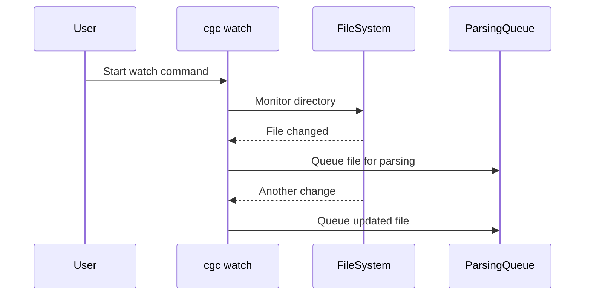

# Indexing Source Code

Indexing extracts syntactic structures and links semantic relationships within a codebase to populate the graph database. CodeGraphContext (CGC) supports multiple scan strategies.

---

## 1. Local Workspace Indexing

To index the repository directory you are currently working in, navigate to the folder and run:

```bash
cd /path/to/project
cgc index
```

### Ingestion Scopes
By default, the `index` command scans all supported source files in the current working directory. You can narrow the scope by specifying a target subdirectory or file:

```bash
# Index only the core module folder
cgc index ./src/core

# Index a single file
cgc index ./src/main.py
```

### Overwriting the Index
CGC tracks modification timestamps and file hashes to perform incremental scans. To force a full re-index of all files, bypass the cache with the `--force` flag:

```bash
cgc index --force
```

---

## 2. Ingesting Third-Party Packages

To trace references to external dependencies (e.g., standard library classes or package functions), you can manually add installed Python libraries to your active code graph.

Use the `add-package` command:

```bash
# Ingest requests library
cgc add-package requests python
```

The command resolves the package's installation path on your system, parses its definitions, and appends the nodes to your active context.

---

## 3. Real-Time Directory Watchers

For active development, run a filesystem watcher in the background to capture file writes and incrementally sync the graph.

```bash
# Start watching the active workspace
cgc watch
```



- **Listing Watchers**: View active file monitors with:
  ```bash
  cgc watching
  ```
- **Stopping Watchers**: Terminate directory monitoring using:
  ```bash
  cgc unwatch /path/to/project
  ```

---

## 4. Ingest Filters (`.cgcignore`)

To prevent compiling bloated indices or parsing build artifacts, define ignore rules in a `.cgcignore` file in the root of your repository or context directory.

### Glob Pattern Rules:
- Lines starting with `#` are treated as comments.
- Directories should terminate with a trailing slash `/`.
- Supports wildcards (`*`) and recursive matches (`**/`).

### Typical `.cgcignore` Configuration:
```text
# Exclude build and compiled outputs
build/
dist/
*.egg-info/
__pycache__/
*.pyc

# Exclude dependency libraries
node_modules/
.venv/
venv/
env/

# Exclude IDE configurations
.git/
.vscode/
.idea/
.project
```
